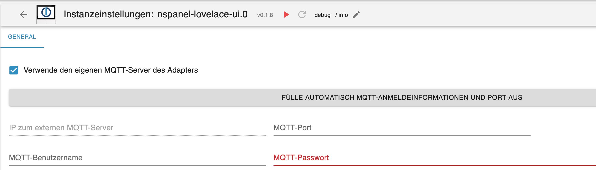
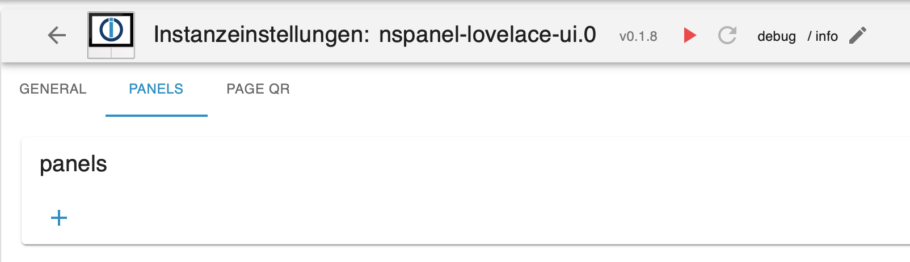
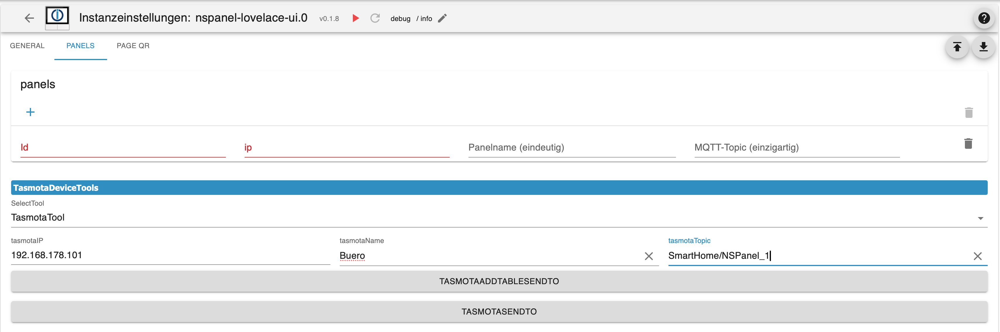
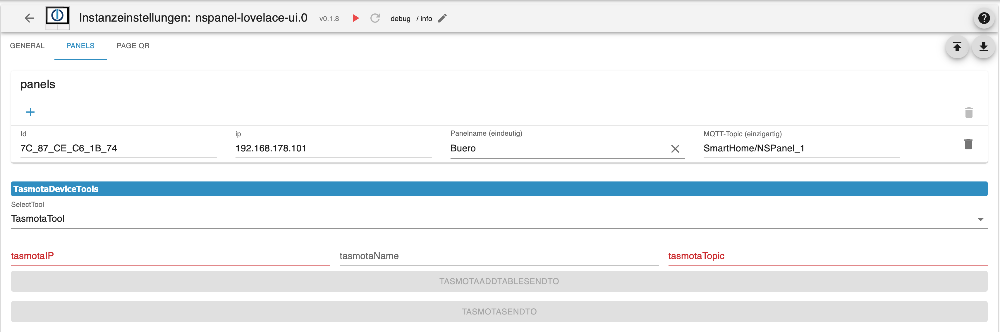
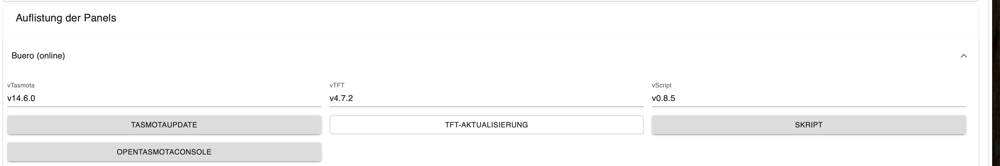
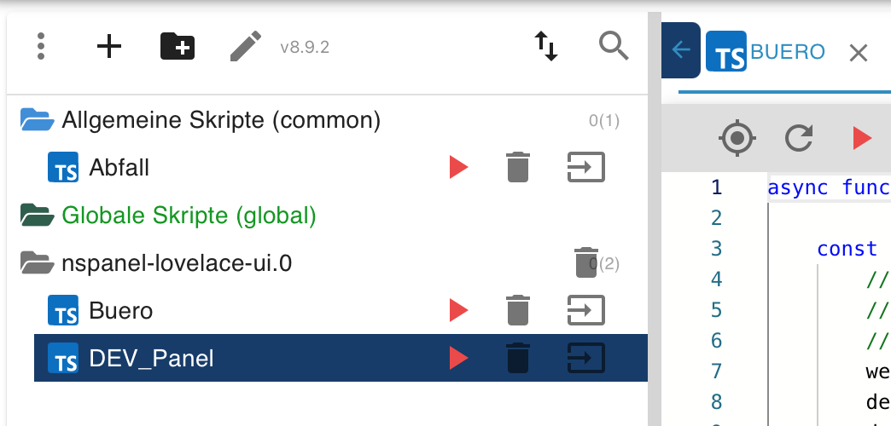

Ablauf:
- Adapter über Expertenmodus und Github/NPM (Katze) installieren
- Im Admin Mqtt einstellen und speichern
  - Bei der Nutzung des internen MQTT Server, ist es möglich, über den Button die Daten automatisch ausfüllen zu lassen. Diese Funktion sucht auch einen freien Port, damit es nicht zu Problemen  mit anderen Adapter kommt. (z.B. Shelly, Sonoff) 
    
  - nach dem Speichern kann auf der Seite `Panels` die MQTT-Daten an das Panel gesendet werden 
  und damit werden die Tasmota-Einstellungen richtig gesetzt.  

- Im Admin unter `Panels`  
  
  
- die IP-Adresse, nach Möglichkeit eine feste IP im Router einstellen
- einen Namen für das Panel vergeben
- den Mqtt-Topic unter dem das Panel lauscht
- den Panel-Typ [EU, US-P, US-L]
- Zeitzone auswählen  

zum Schluss auf den Button "NSPanel-Initialisierung" klicken  
  
Nach der Initialisierung wird das Panel in der Liste automatisch eingetragen  

  
  
mit den Tasmota-Tools kann der Berry Treiber und die TFT-Firmware installiert werden. Dazu wird die IP/ Panel im Feld `IP des Panel` ausgewäht. Zusätlich besteht die Möglichkeit Tasmota neu zu starten und in die WebUI von Tasmota zu springen. (neues Fenster / Popup) 

Speichern und schliessen

Nächster Schritt:  

In der Seite Maintain das Panel auswählen und über den Button `Script` die aktuelle Version des Konfig-Scriptes anlegen. Es wird im JavaScript-Adapter in einem Ordner mit dem Namen der Adapter Instanz gespeichert. Der Dateiname gleicht dem Panelnamen.  


- das Konfig-Script 

[Beispiel Konfigurationsskript](script/example_sendTo_script_iobroker.ts)
- Anschauen und die Konfiguration aus einem vorhandenen aktuellen Nspanel-Skript hinein kopieren.  
**Alle Servicepages** aus dem alten Skript nicht übernehmen.
- Der Topic hier muß identisch sein mit einem der Topics aus dem Admin.
- Jede Seite braucht eine Eigenschaft `uniqueName`

z.B. 
```
const main: PageType = {
    'type': 'cardGrid',
    uniqueName:'main',
    'heading': 'Wohnzimmer',
    'useColor': true,
    'items': [
        { navigate: true, id: 'alias.0.NSPanel.1.usr.Temperatur.M.Wohnzimmer', targetPage: 'this_Thermostat',name: 'Wohnzimmer', onColor: MSRed, offColor: Blue, useValue: true, colorScale: {'val_min': -20, 'val_max': 40, 'val_best': 19} },
        { id: 'alias.0.NSPanel.1.usr.Fenster.Obergeschoss.Wohnzimmer.room', onColor: MSRed, offColor: MSGreen},
        //{ navigate: true, id: '', targetPage: 'Alexa_Schlafzimmer', onColor: White},
        { navigate: true, icon:'home', name:'Haus', targetPage: 'MenuGrid', onColor: White},
    ]};
```
- Die Hauptseite muß **main** heißen
- `next`, `prev`, `home`, `parent` müssen Strings sein die auf einen der `uniqueName` verweist.
- Seiten die in `pages` eingetragen werden, werden im Kreis miteinander verlinkt, alle anderen Seiten die verwendet werden sollen müssen in `subPages` aufgeführt sein
- `button1` und `button2` ***haben eine neue Konfiguration***
- `useValue` wird nicht verwendet.

Wenn alles eingestellt ist, Skript starten und auf die Rückmeldung warten, das Skript beendet sich selbst.

Dabei bedeutet die Phrase: `not implemented yet!` das wir es noch nicht eingebaut habe und `not supported` das wir das auch nicht werden :)

Bei Fragen fragen - Discord, Frum, hier, Telegram, Teams alles vorhanden :)


[Alias Tabelle](ALIAS.md)  
  
[Zurück](README.md#aktuelle-version)  
