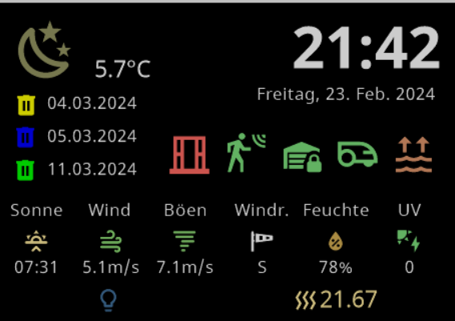

# ioBroker.nspanel-lovelace-ui

[](https://www.npmjs.com/package/iobroker.nspanel-lovelace-ui)
[](https://www.npmjs.com/package/iobroker.nspanel-lovelace-ui)


[](https://nodei.co/npm/iobroker.nspanel-lovelace-ui/)

**Tests:** 

[](https://weblate.iobroker.net/projects/adapters/nspanel-lovelace-ui/)

## nspanel-lovelace-ui adapter for ioBroker

NsPanel Lovelace UI is a Firmware for the nextion screen inside of NSPanel in the Design of Lovelace UI Design.

### Short Description

The NSPanel Lovelace UI is an alternative user interface for the Sonoff NSPanel, specifically designed for integration with iobroker. It typically relies on Tasmota (firmware) and MQTT (messaging protocol) to provide custom controls and displays directly on the NSPanel's small touchscreen.

### What is the NSPanel?

The Sonoff NSPanel is a smart wall switch with:

- two physical relay switches
- a 3.5-inch touchscreen
- temperature and brightness sensors

It was originally developed for the eWeLink app, but can be integrated much more powerfully with ioBroker using alternative firmware

### What does the "NSPanel Lovelace UI" do?

With this custom UI, you can:

- Display Lovelace-like Cards on the NSPanel
- Display sensor values ​​(e.g., temperature, humidity)
- Control scenes and automations
- Control lights, thermostats, and other devices directly on the screen

---

### Installation & Questions

Adapter Wiki: https://github.com/ticaki/ioBroker.nspanel-lovelace-ui/wiki  
Adapter Community (ioBroker Forum): [Forum](https://forum.iobroker.net/topic/80055/alphatest-nspanel-lovelace-ui-v0-1-1)

---

## The following HMI components are already integrated into the NSPanel adapter:

### HMI Cards

- [x] screensaver
- [x] screensaver2
- [x] screensaver3
- [x] cardChart
- [x] cardLChart
- [ ] cardLChart2 (new - in progress)
- [x] cardEntities
- [x] cardSchedule
- [x] cardGrid
- [x] cardGrid2
- [x] cardGrid3
- [x] cardThermo
- [ ] cardMedia
- [x] cardUnlock
- [x] cardQR
- [ ] cardAlarm
- [x] cardPower

### HMI Popups

- [x] popupInSel
- [x] popupFan
- [x] popupThermo
- [x] popupNotify
- [x] popupShutter
- [x] popupShutter2
- [x] popupLight
- [x] popupLight2
- [x] popupTimer
- [x] popupSlider
- [ ] popupColor (new - in progress)

---

## Buzzer Control

The adapter supports buzzer control for NSPanel devices using the Tasmota `Buzzer` command. This enables button sounds, urgent message notifications, and general buzzer control.

### Prerequisites

To use the buzzer functionality, ensure your NSPanel Tasmota firmware has `SetOption111 1` enabled. This uses BuzzerPwm for piezo buzzer frequency output instead of on/off signal.

### Usage Methods

#### 1. State-based Control

Each panel has a buzzer control state: `panels.{panelName}.cmd.buzzer`

```javascript
// Set buzzer command (tone, duration, count, frequency)
setState('nspanel-lovelace-ui.0.panels.Panel1.cmd.buzzer', '1,2,3,0xF54');

// Examples:
setState('nspanel-lovelace-ui.0.panels.Panel1.cmd.buzzer', '1'); // Single beep
setState('nspanel-lovelace-ui.0.panels.Panel1.cmd.buzzer', '1,5'); // Longer beep
setState('nspanel-lovelace-ui.0.panels.Panel1.cmd.buzzer', '2,3,5'); // 5 beeps
```

#### 2. SendTo Interface

```javascript
// Basic buzzer command
sendTo('nspanel-lovelace-ui.0', 'buzzer', {
    panel: 'panelTopic',
    command: '1,2,3,0xF54',
});

// Button feedback sound
sendTo('nspanel-lovelace-ui.0', 'buzzer', {
    panel: 'kitchen_panel',
    command: '1',
});

// Urgent notification
sendTo('nspanel-lovelace-ui.0', 'buzzer', {
    panel: 'living_room',
    command: '3,5,10,0x800', // High-pitched, multiple beeps
});
```

### Buzzer Command Format

The buzzer command follows Tasmota's format: `tone,duration,count,frequency`

- **tone**: 1-4 (tone type)
- **duration**: 1-10 (duration units, ~100ms each)
- **count**: 1-255 (number of beeps)
- **frequency**: 0x100-0xFFFF (piezo frequency in hex)

**Examples:**

- `1` - Single short beep
- `1,5` - Single longer beep
- `2,3,5` - 5 medium beeps with tone 2
- `1,2,3,0xF54` - 3 short beeps with custom frequency

---

## Changelog

<!--
    Placeholder for the next version (at the beginning of the line):
    ### **WORK IN PROGRESS**
-->
### **WORK IN PROGRESS**
- (ticaki) color for brightsky favorit fixed

### 0.7.3 (2025-11-09)
- (ticaki) Switch from global subscript to individual subscriptions
- (ticaki) model us-p fixed
- (ticaki) update deps

### 0.7.2 (2025-10-27)
- (ticaki) selection disappears - fixed

### 0.7.1 (2025-10-27)
- (ticaki) Initialise pageConfig

### 0.7.0 (2025-10-26)
- (ticaki) Use of IDs in colour specifications for pageItem icons and screensaver icons enabled.
- (ticaki) Admin: tweak alarm
- (tt-tom17) Admin: redo pageQR configuration (BREAKING)
- (tt-tom17 & ticaki) New layout of the page configuration

### 0.6.8 (2025-10-24)
- (ticaki) Error during conversion to fetch prevented adding of panels. Fixed.

### 0.6.7 (2025-10-22)
- (ticaki) PagePower: Added favorite unit selection for power display
- (ticaki) Grid/Entities pages: Improved update performance with reduced minimum update interval
- (ticaki) PageItem icons: Enabled use of state IDs in color specifications
- (tt-tom17) ChartBar: Fixed display issues
- (ticaki) Battery template (BYD HVS): Fixed charging status detection (power = 0 is no longer treated as charging)
- (Armilar) HMI: Fixed cardAlarm icon display and screensaver standard/alternate mode switching

### 0.6.6 (2025-10-17)
- (tt-tom17) Chart: Added "NO DATA" label when chart has no data to display - fixes [#471](https://github.com/ticaki/ioBroker.nspanel-lovelace-ui/issues/471)
- (ticaki) PageItem info: Fixed missing scale property - fixes [#532](https://github.com/ticaki/ioBroker.nspanel-lovelace-ui/issues/532)
- (ticaki) Templates: Added Roborock vacuum status mapping template
- (ticaki) PageAlarm: Fixed race conditions on fast adapter restarts (timeout cleanup, unload checks)
- (ticaki) Refactor type definitions

### 0.6.5 (2025-10-14)

- (Armilar) HMI: Fixed screensaver notify in advanced screensaver mode
- (Armilar) HMI: Fixed cardChart/cardLChart length/width issues, added "No Data" label, corrected y-axis label positioning
- (ticaki) Core: Added touch event blocking (400ms) to prevent accidental double-clicks during page transitions
- (ticaki) TypeScript: Removed deprecated useColor property from type definitions
- Note: HMI fixes listed above will be delivered separately via a firmware update and are not tied to this adapter release.

### 0.6.4 (2025-10-13)

- (ticaki) use tasmota version from version.json
- (ticaki) Added disarmed buttons (5–8) to UnlockPage, implemented a responsive two-column layout.
- (ticaki) Improved NavigationAssignmentPanel to show per-panel notices in the lower overview, add a per-item trash icon (hover + mobile two-step confirmation)

### 0.6.3 (2025-10-10)

- (ticaki) alarm and approved fixed - static dp for approve

### 0.6.2 (2025-10-10)

- (ticaki) PageUnlock: Config updated — fixed issue where some settings were not applied correctly.
- (ticaki) IconSelect showed a too short list. Fixed.
- (ticaki) Admin: Added responsive layout for Admin PageUnlock (mobile devices)

### 0.6.0 (2025-10-09)

- (tt-tom17) Color theme keys documented (`doc/de/colorTheme.md`, English version `doc/en/colorTheme.md`)
- (ticaki) Admin: Added Unlock/Alarm editor to admin UI (headline, PIN, buttons, setNavi, duplicate-name check) - first admin only config for a page
- (ticaki) Admin: Added navigation flow editor to admin UI (expert mode must be enabled)
- (tt-tom17) Chart scale: rounded to nearest tens
- (tt-tom17) PagePower: improved icon selection in admin
- (ticaki) German documentation for screensaver notification features `isDismissiblePerEvent` and `dismissibleIDGlobal` added to `doc/de/screensaver.md`

### 0.5.0 (2025-10-03)

- (tt-tom17) Admin UI: Reworked/reordered settings layout and improved usability
- (ticaki) Added globalPages/globalLink feature with Deep Linking support for reusable page configurations across multiple panels
- (ticaki) Added screensaver notification system
- (ticaki) Fixed cardThermo2 not switching
- (ticaki) Implemented hiding of screensaver elements
- (ticaki) Adjusted Brightsky templates
- (ticaki) made script configuration transfer more robust

### 0.4.0 (2025-09-13)

- (ticaki) Panels can now be restarted individually while the adapter is running; faulty or missing configurations prevent restart with clear error messages
- (ticaki) Media logo field now supports Alexa play/pause toggle and Spotify seek position popup
- (ticaki) Added new channel role "media" with status display and pageMedia fallback; for this role only, added `asControl` as PageItem property
- (ticaki) Fixed state evaluation: `getState() === null` no longer interpreted as missing state; boolean states now return `false` instead of `null` if the state exists but has no value.
- (copilot) Added support for ioBroker Sonos-Adapter in cardMedia - play/pause/stop, volume, title/artist/album, shuffle, repeat controls
- (copilot) Added buzzer functionality for NSPanel devices - enables button sounds, urgent message notifications, and general buzzer control via state and sendTo interface
- (copilot) Added support for ioBroker MPD-Adapter in cardMedia - play/pause/stop, volume, title/artist/album, shuffle, repeat controls
- (ticaki) Added support for ioBroker spotify-premium in cardMedia - play/pause/stop, volume, title/artist/album, shuffle, repeat controls
- (ticaki) Startup significantly improved and hangs removed
- (ticaki) Colour themes added, but by no means used everywhere yet
- (ticaki) Page items on the cardMedia can be given custom colours
- (ticaki) Each card belonging to the Menu group can use classic or arrow scrolling - default is classic (cardGrid\*, cardEntities, cardSchedule, cardThermo2, cardMedia)
- (ticaki) When scrolling classic there is half page or full page “page” or “half” - default is “page” - “half” is supported by cardGrid\*, cardThermo2

### 0.3.0 (2025-09-01)

- (ticaki) Refractor code
- (ticaki) activate cardMedia (alexa2 only)
- (ticaki) Fixes [#409](https://github.com/ticaki/ioBroker.nspanel-lovelace-ui/issues/409)
- (ticaki) cardThermo2 integrated
- (ticaki) extended pirate-weather templates
- (tt-tom17) added pirate-weather templates
- (ticaki) PagePower decimal places problem fixed

### 0.2.4 (2025-08-06)

- (ticaki) popupSlider added
- (ticaki) Auto update of berry driver
- (ticaki) Admin option added for how shutter positions are interpreted.
- (ticaki) add Screensaver Notifications fixed #361 3 States or `sendTo('nspanel-lovelace-ui.0', 'screensaverNotify', { panel: 'panelTopic', heading: 'Heading', text: 'Text', enabled: true });`
- (ticaki) Hide pages - fixed #360
- (ticaki) RuleTimer1 changed to RuleTimer3
- (tt-tom17) hide pages for cardPower, cardQR and cardChart
- (tt-tom17) added hide cards feature to service pages

### 0.2.3 (2025-07-27)

- (ticaki) openweathermap added as standard weather adapter
- (ticaki) Some adjustments due to updated firmware
- (ticaki) Some improvements

### 0.2.2 (2025-07-19)

- (tt-tom17) improved PageQR
- (ticaki) BREAKING: alias def changed
- (ticaki) actual-set handling changed
- (tt-tom17) popupFan added

### 0.2.1 (2025-06-30)

- (ticaki) Modified script version comparison

### 0.2.0 (2025-06-30)

- (tt-tom17) Additional options added to the service pages
- (ticaki) light2 added
- (ticaki) popupShutter2 added
- (ticaki) fixed Tempcolor & dimmer
- (ticaki) Show service menu navigation even if there is only one page in pages

### 0.1.12 (2025-05-04)

- (tt-tom17) added cardChart/cardLChart inkl. admin

### 0.1.11 (2025-04-12)

- (ticaki) Admin overview revised
- (ticaki) inSel could not be left fixed
- (ticaki) Missing navigation of a page is reported
- (tt-tom17) PagePower improved

### 0.1.10 (2025-04-08)

- (ticaki) refactoring startup
- (ticaki) added configuration script tools in admin
- (ticaki) added/fixed some pageitems
- (ticaki) added maintain in admin
- (ticaki) added navigation in admin
- (tt-tom17) added PagePower incl. admin

### 0.1.9 (2025-03-21)

- (ticaki) added: tasmota web ui user & password Fixes #164
- (ticaki) BREAKING: Internal server use TLS - New tasmota config for internal server.
- (tt-tom17) added servicepage items
- (ticaki) added lock
- (ticaki) cardThermo with input_sel
- (ticaki) Added: Admin option to fix wrong common.type=state in alias.0 to common.type=mixed
- (ticaki) Required data points are found via role, type etc. The designation only plays a role in rare cases.

### 0.1.8 (2025-03-10)

- (ticaki) added: hw-buttons with actions
- (ticaki) fixed: screensaver trigger
- (ticaki) check if port is free for mqtt server
- (ticaki) check and tweak role info
- (ticaki) fixed: entities and grid icons/text
- (ticaki) tools for tasmota added to admin
- (ticaki) tweak panel response time
- (ticaki) 'switch' added
- (tt-tom17) completed servicepages

### 0.1.7 (2025-03-06)

- (ticaki) cardGrid Number values -> Show an icon if user has defined one, otherwise number
- (ticaki) fixes #143
- (ticaki) fixes #147
- (ticaki) fixes #146
- (ticaki) fixes #144
- (ticaki) fixes #148

### 0.1.6 (2025-03-05)

- (ticaki) fixes #140
- (ticaki) fixes #141

### 0.1.5 (2025-03-03)

- (ticaki) fixes [#135](https://github.com/ticaki/ioBroker.nspanel-lovelace-ui/issues/135)
- (ticaki) fixes #133
- (ticaki) Configuration is reconfigured at every start. If this fails, the saved conversion is used.
- (ticaki) The raw version and a converted version are saved when the configuration is transferred.
- (ticaki) parent added to navigation
- (ticaki) cardQR added

### 0.1.4 (2025-03-03)

- (ticaki) fixes #131

### 0.1.3 (2025-03-02)

- (ticaki) Data point generation changed
- (ticaki) Dimming mode (data points) completed
- (ticaki) Screensaver double-click added

### 0.1.2 (2025-02-27)

- (ticaki) fixed nav service right
- (ticaki) screensaver rotation time added
- (ticaki) grid scrolling improved
- (ticaki) Feedback from the script improved
- (Kuckuckmann:) new adapter logo

### 0.1.1 (2025-02-27)

- (ticaki) fixed color fading
- (ticaki) fixed config script
- (ticaki) added message for missing states

### 0.1.0 (2025-02-25)

- (ticaki) alot changes

### 0.1.0-preAlpha.0 (2024-03-09)

- (ticaki) alot :)

### 0.0.4-preAlpha.3 (2024-02-20)

- (ticaki) testversion

### 0.0.4-preAlpha.2 (2024-02-12)

- (ticaki) Add button flip to cardThermo

### 0.0.4-preAlpha.1 (2024-02-12)

- (ticaki) cardThermo, script config

### 0.0.4-preAlpha.0 (2024-02-01)

- (ticaki) admin save - still deep alpha

### 0.0.3-preAlpha.0 (2024-02-01)

- (ticaki) alot - still dont install this

### 0.0.2-JustPlaceholder.0 (2024-01-05)

- (ticaki) initial release

## License

MIT License

Copyright (c) 2024-2025 ticaki <github@renopoint.de>

Permission is hereby granted, free of charge, to any person obtaining a copy
of this software and associated documentation files (the "Software"), to deal
in the Software without restriction, including without limitation the rights
to use, copy, modify, merge, publish, distribute, sublicense, and/or sell
copies of the Software, and to permit persons to whom the Software is
furnished to do so, subject to the following conditions:

The above copyright notice and this permission notice shall be included in all
copies or substantial portions of the Software.

THE SOFTWARE IS PROVIDED "AS IS", WITHOUT WARRANTY OF ANY KIND, EXPRESS OR
IMPLIED, INCLUDING BUT NOT LIMITED TO THE WARRANTIES OF MERCHANTABILITY,
FITNESS FOR A PARTICULAR PURPOSE AND NONINFRINGEMENT. IN NO EVENT SHALL THE
AUTHORS OR COPYRIGHT HOLDERS BE LIABLE FOR ANY CLAIM, DAMAGES OR OTHER
LIABILITY, WHETHER IN AN ACTION OF CONTRACT, TORT OR OTHERWISE, ARISING FROM,
OUT OF OR IN CONNECTION WITH THE SOFTWARE OR THE USE OR OTHER DEALINGS IN THE
SOFTWARE.
