# Page Thermo2 – Konfiguration im Admin

Die Thermostat-Seite `cardThermo2` lässt sich ohne Skript im Admin anlegen: Tab **PageConfig**, Seitentyp **Thermostat (Thermo2)**. Der Editor zeichnet die Seite so, wie das Panel sie zeigt – jede Stelle der Karte ist anklickbar und öffnet die passenden Einstellungen. Im Adapter läuft die Admin-Seite durch denselben Code wie die Skript-Seite, das Ergebnis auf dem Panel ist identisch.

Die Skript-Konfiguration (Aufbau, Alias-Rollen, Datenpunkte, `modeList`, `sortOrder` …) steht unter [Page Thermo2](PageThermo2). Diese Seite beschreibt nur den Weg über den Admin.

Inhalt:
- [Seite anlegen](#1-seite-anlegen)
- [Der Editor im Überblick](#2-der-editor-im-überblick)
- [Heizkreis: Datenquelle und Überschrift](#3-heizkreis-datenquelle-und-überschrift)
- [Solltemperatur: Minimum, Maximum, Schrittweite](#4-solltemperatur-minimum-maximum-schrittweite)
- [Anzeige der Werte: Symbol, Farbe, Einheit](#5-anzeige-der-werte-symbol-farbe-einheit)
- [Modusanzeige](#6-modusanzeige)
- [Heizkreis-Symbol](#7-heizkreis-symbol)
- [PageItems: anlegen, verschieben, freie Flächen](#8-pageitems-anlegen-verschieben-freie-flächen)
- [Anordnung der Flächen](#9-anordnung-der-flächen)
- [Speichern, Panel-Zuweisung, Navigation](#10-speichern-panel-zuweisung-navigation)
- [Wenn etwas nicht wie erwartet aussieht](#11-wenn-etwas-nicht-wie-erwartet-aussieht)

## 1. Seite anlegen

1. Instanz-Einstellungen öffnen → Tab **PageConfig**.
2. Links in der Liste **Seiten** auf das PLUS klicken, als Typ **Thermostat (Thermo2)** wählen und eine **eindeutige ID** vergeben (der Seitenname, über den die Seite in der Navigation angesprochen wird).
3. Die neue Seite erscheint in der Liste; rechts öffnet sich der Editor. Eine neue Seite hat noch keinen Heizkreis – der Editor weist darauf hin und bietet den Heizkreis-Dialog an (siehe [Heizkreis](#3-heizkreis-datenquelle-und-überschrift)).

Die Felder **Panel-Filter** und **Seitentyp** über der Liste filtern nur die Anzeige der Liste.

## 2. Der Editor im Überblick

| Element | Bedeutung |
|---|---|
| **Eindeutige ID** | Seitenname; bei der Startseite (`main`) gesperrt. |
| **Tabs über dem Panel** | Ein Tab je Heizkreis, wie das Panel zählt (ein `airCondition`-Channel ergibt zwei Tabs: Heizen und Kühlen). Das **+** rechts legt einen neuen Heizkreis an (höchstens 8). |
| **Überschrift** im Panel | Klick → Dialog *Heizkreis* (Datenquelle, Überschrift, Reihenfolge, Entfernen). |
| **Zeile 1** (Thermometer, Ist-Temperatur) und **Zeile 3** (Tropfen, Luftfeuchte) | Klick → Dialog *Anzeige der Werte* (Symbol, Farbe, Einheit). |
| **Große Zahl** (Solltemperatur) | Klick → Dialog *Solltemperatur* (Minimum, Maximum, Schrittweite). |
| **Modustext** (z. B. MANUAL) | Klick → Dialog *Modusanzeige* (Modustexte). |
| **Neun Flächen** | Die PageItems der Seite in der echten Reihenfolge des Panels: vier links, vier rechts, die neunte zwischen − und +. Gestrichelt = frei, Schloss = vom Adapter belegt (Heizkreis-Auswahl und die aus dem Alias erzeugten Buttons), grüner Rahmen = Item nur für diesen Heizkreis, blauer Rahmen = Item für alle Heizkreise. |
| **Seite x/y** mit Pfeilen | Mehr als neun Einträge werden geblättert – wie auf dem Panel. |
| **Anordnung der Flächen** | Die Sortierung der Flächen (`sortOrder`), siehe [Anordnung](#9-anordnung-der-flächen). |
| **PageItem hinzufügen** | Neues Item für den gewählten Heizkreis (gleichbedeutend mit dem Klick auf eine freie Fläche). |
| **Heizkreis-Symbol** | Dialog für Symbol und Farben der Heizkreis-Auswahlflächen. |

Rechts daneben liegt wie bei allen Seiten der Bereich **Navigation/Panel** (Zuweisung zu einem Panel, `prev`/`next`/`parent`/`home`, Systemseiten, *hidden*, *alwaysOn*).

## 3. Heizkreis: Datenquelle und Überschrift

Klick auf die **Überschrift** öffnet den Dialog für den gerade gewählten Heizkreis, das **+** über dem Panel den Dialog für einen neuen.

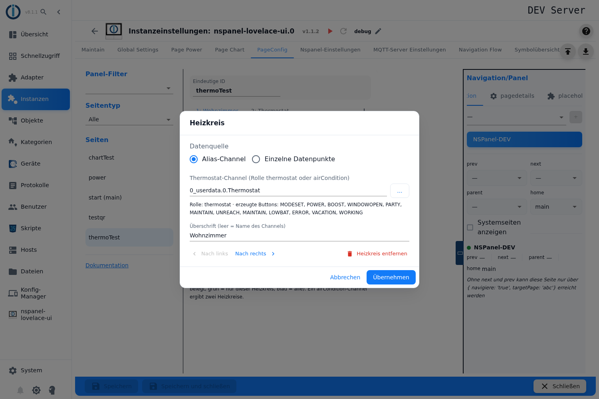

**Datenquelle – Alias-Channel:** Ein Channel mit der Rolle `thermostat` oder `airCondition` (siehe [Alias-Tabelle](ALIAS)). Die ID lässt sich eintippen oder über **…** aus dem Objektbaum wählen; der Baum zeigt Channels, Geräte und Ordner.

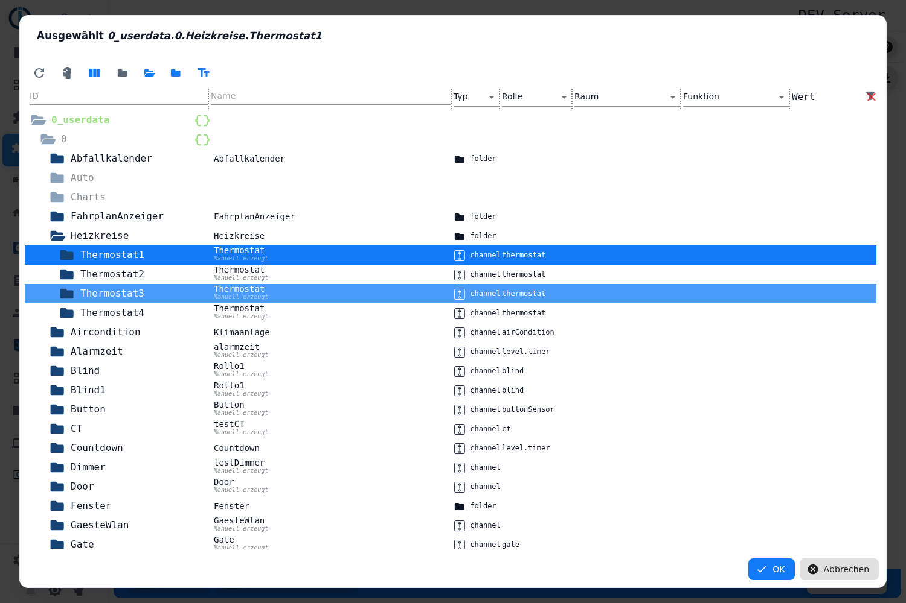

Direkt nach der Auswahl prüft der Editor den Channel und zeigt **Rolle** und die **Buttons, die der Adapter aus den Datenpunkten des Alias erzeugt** (MODESET oder AUTOMATIC/MANUAL/OFF, POWER, BOOST, WINDOWOPEN, PARTY, MAINTAIN, UNREACH, LOWBAT, ERROR, VACATION, WORKING – jeweils nur, wenn der Datenpunkt vorhanden ist). Diese Buttons belegen die ersten Flächen und sind im Mockup mit einem Schloss markiert; sie lassen sich hier nicht verändern. Hat der Channel eine andere Rolle oder gibt es das Objekt nicht, erscheint eine Warnung:

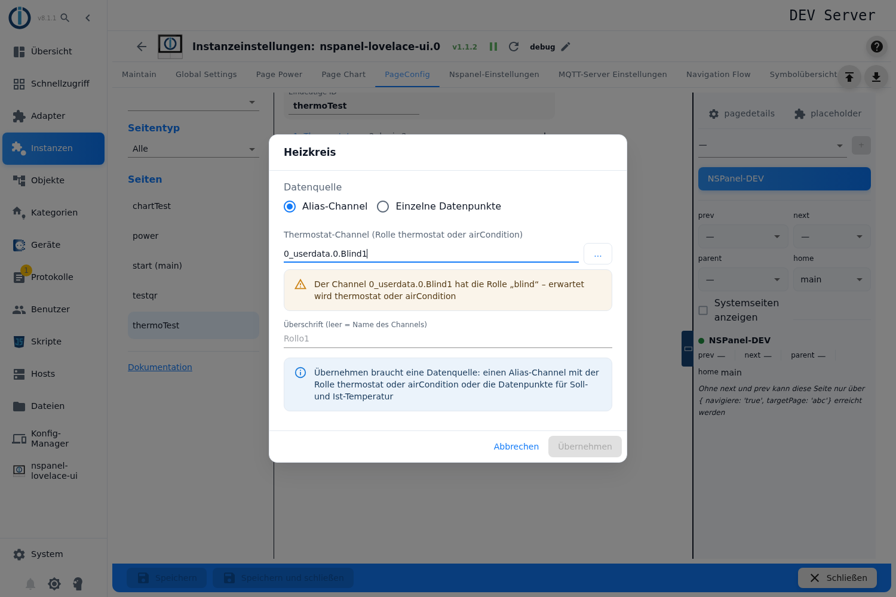

**Datenquelle – Einzelne Datenpunkte:** Statt eines Alias werden die Datenpunkte direkt angegeben – **Solltemperatur** (schreibbar), **Ist-Temperatur**, optional **Luftfeuchte** und **Modus** (Zahl oder Text). In diesem Modus erzeugt der Adapter keine Buttons aus dem Alias.

**Überschrift:** leer = `common.name` des Channels. Bei einem `airCondition`-Channel gibt es zusätzlich die **Überschrift Kühlen** für den zweiten Tab.

**Nach links / Nach rechts** ändert die Reihenfolge der Heizkreise (und damit die Nummern der Auswahlflächen), **Heizkreis entfernen** löscht ihn samt der Items, die nur an ihn gebunden sind. Beim Verschieben wandern die Items mit.

**Übernehmen** ist erst möglich, wenn die Datenquelle plausibel ist: ein Alias-Channel mit passender Rolle bzw. Soll- und Ist-Datenpunkt. Ein neuer Heizkreis entsteht erst mit *Übernehmen* – *Abbrechen* hinterlässt nichts.

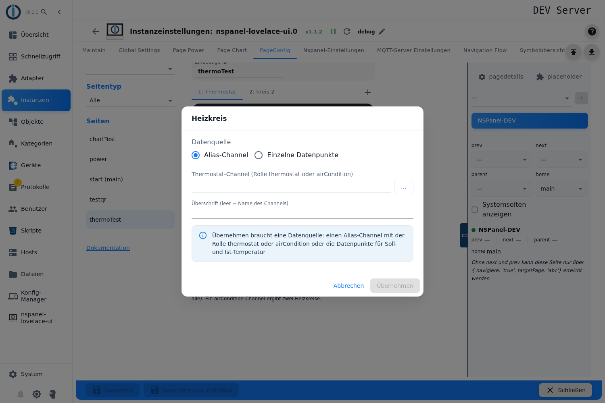

Enthält eine ältere Konfiguration Heizkreise ohne Datenquelle, meldet der Editor das über den Tabs mit einem Knopf **Entfernen**; der Adapter überspringt solche Heizkreise ohnehin.

## 4. Solltemperatur: Minimum, Maximum, Schrittweite

Klick auf die **große Zahl** im Ring.

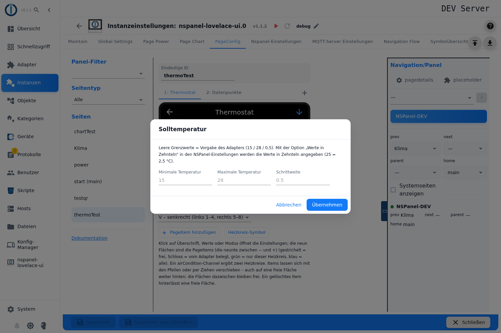

- **Minimale / Maximale Temperatur** und **Schrittweite** der Solltemperatur. Leere Felder = Vorgabe des Adapters (15 / 28 / 0,5).
- Mit der Option *Werte in Zehnteln* in den NSPanel-Einstellungen werden die Werte in Zehnteln angegeben (25 = 2,5 °C) – genau wie im Skript.

## 5. Anzeige der Werte: Symbol, Farbe, Einheit

Klick auf **Zeile 1** (Ist-Temperatur) oder **Zeile 3** (Luftfeuchte).

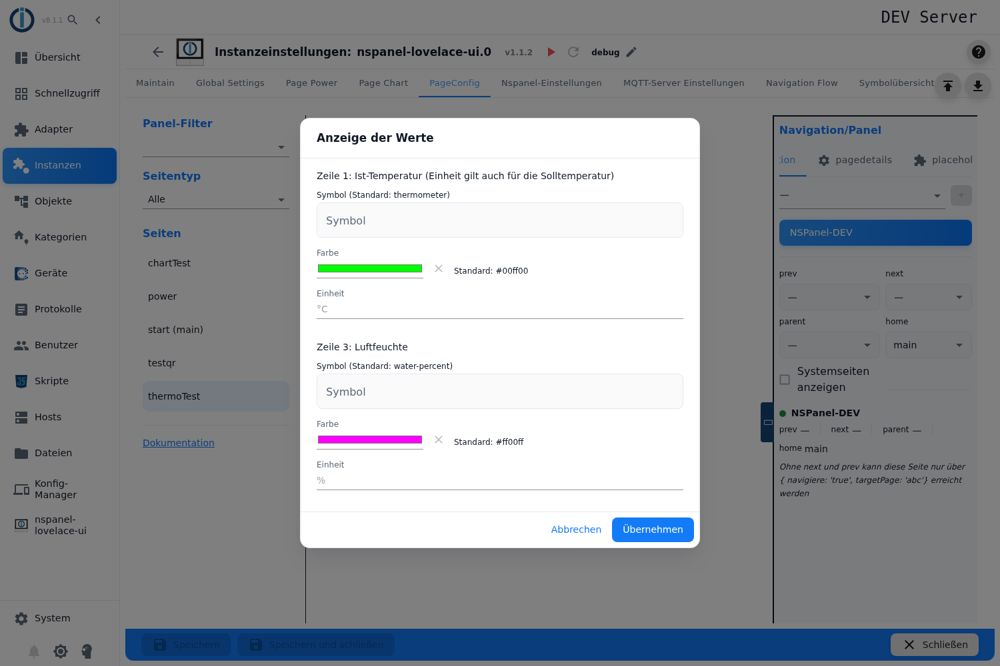

Je Zeile: **Symbol** (Standard `thermometer` bzw. `water-percent`, Auswahl aus der Symbolliste), **Farbe** (Standard grün bzw. magenta; das **×** setzt auf den Standard zurück) und **Einheit** (Standard `°C` bzw. `%`). Die Einheit der Zeile 1 gilt auch für die Solltemperatur.

## 6. Modusanzeige

Klick auf den **Modustext** unter dem Ring.

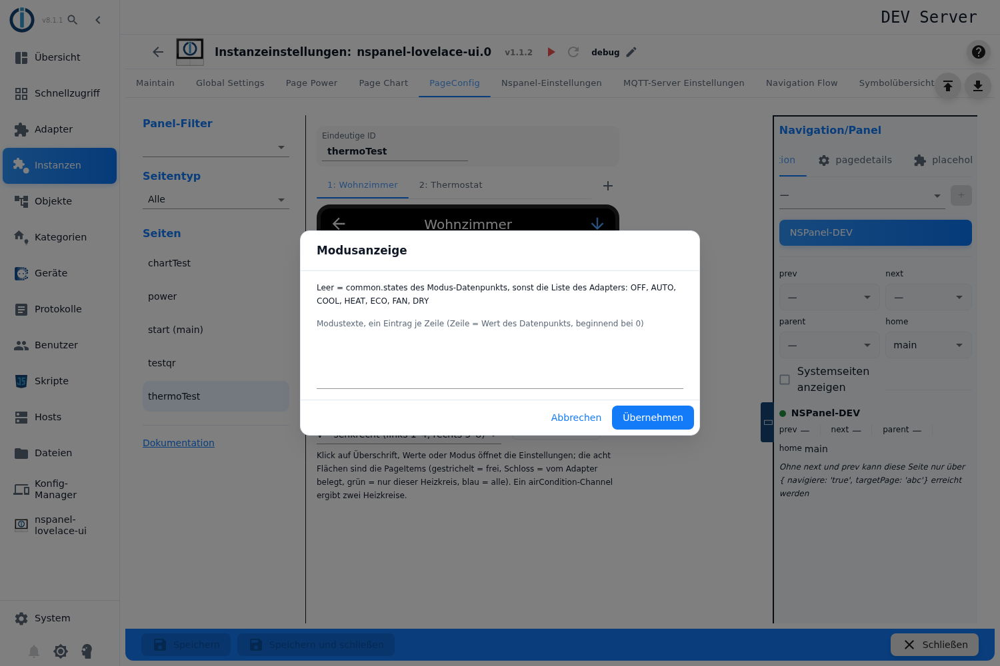

**Modustexte, ein Eintrag je Zeile** – die Zeilennummer entspricht dem Wert des Modus-Datenpunkts, beginnend bei 0. Leer = der Adapter nimmt `common.states` des Modus-Datenpunkts, und falls es die nicht gibt, seine eigene Liste (OFF, AUTO, COOL, HEAT, ECO, FAN, DRY). Entspricht `modeList` im Skript.

## 7. Heizkreis-Symbol

Knopf **Heizkreis-Symbol** unter dem Panel.

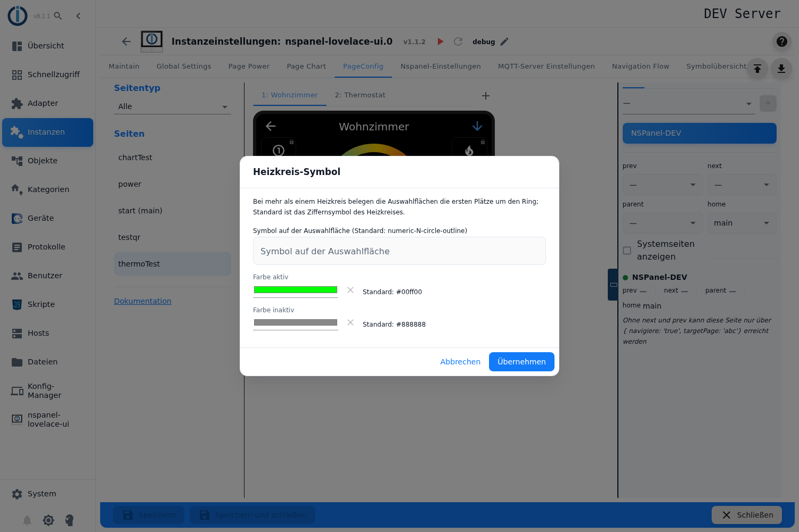

Bei mehr als einem Heizkreis belegen die Auswahlflächen (①, ② …) die ersten Plätze um den Ring. Hier werden **Symbol** (Standard: Ziffer des Heizkreises), **Farbe aktiv** (Standard grün) und **Farbe inaktiv** (Standard grau) festgelegt; bei einem `airCondition`-Channel gibt es die Felder ein zweites Mal für den Kühlkreis. Entspricht `iconHeatCycle`, `iconHeatCycleOnColor`, `iconHeatCycleOffColor` (und `…2`) im Skript.

## 8. PageItems: anlegen, verschieben, freie Flächen

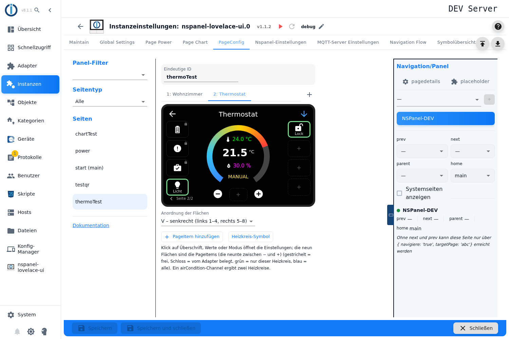

- **Anlegen:** Klick auf eine freie Fläche oder **PageItem hinzufügen** öffnet den bekannten Item-Dialog (Channel, Rolle, Navigation, Symbole, Farben …). Neu ist dort das Feld **Heizkreis**: *alle Heizkreise* oder genau einer – das Item erscheint dann nur bei diesem Heizkreis (entspricht `filter` im Skript). Wird eine freie Fläche weiter hinten angeklickt, landet das Item genau dort; die Flächen davor bleiben frei.
- **Bearbeiten:** Klick auf das Item.
- **Verschieben:** Beim Überfahren erscheinen Pfeile (eine Fläche nach links/rechts) und der Papierkorb. Items lassen sich außerdem **ziehen** – auf eine belegte Fläche (die beiden tauschen) oder auf eine freie Fläche weiter hinten (die Flächen dazwischen bleiben frei). Während des Ziehens wird das Item halbtransparent, das Ziel hervorgehoben.
- **Löschen:** Der Papierkorb löscht das Item; seine Fläche bleibt frei, die übrigen Items behalten ihre Plätze.
- **Freie Flächen zwischen Items** werden mitgespeichert (als leere Items je Heizkreis) und auf dem Panel als leere Plätze angezeigt. Freie Flächen am Ende werden verworfen.
- **Blättern:** Mehr als neun Einträge verteilen sich auf mehrere Seiten; die Seitenzahl steht unten links im Panel, auf dem Panel blättert der Pfeil rechts oben.

Der Item-Dialog mit dem Feld **Heizkreis** (vorbelegt mit dem gerade gewählten Heizkreis):

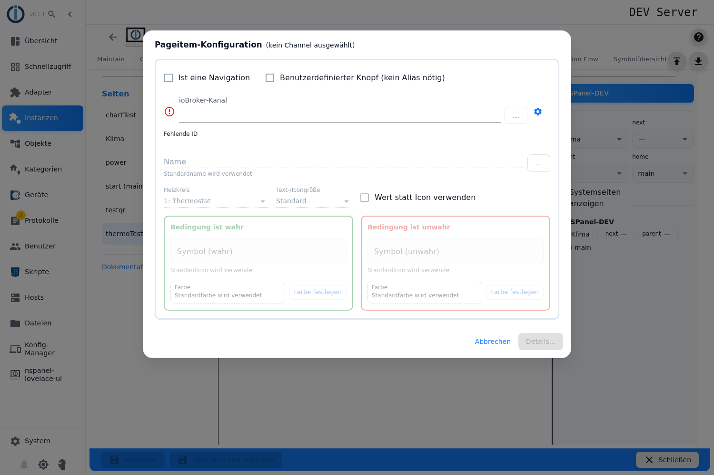

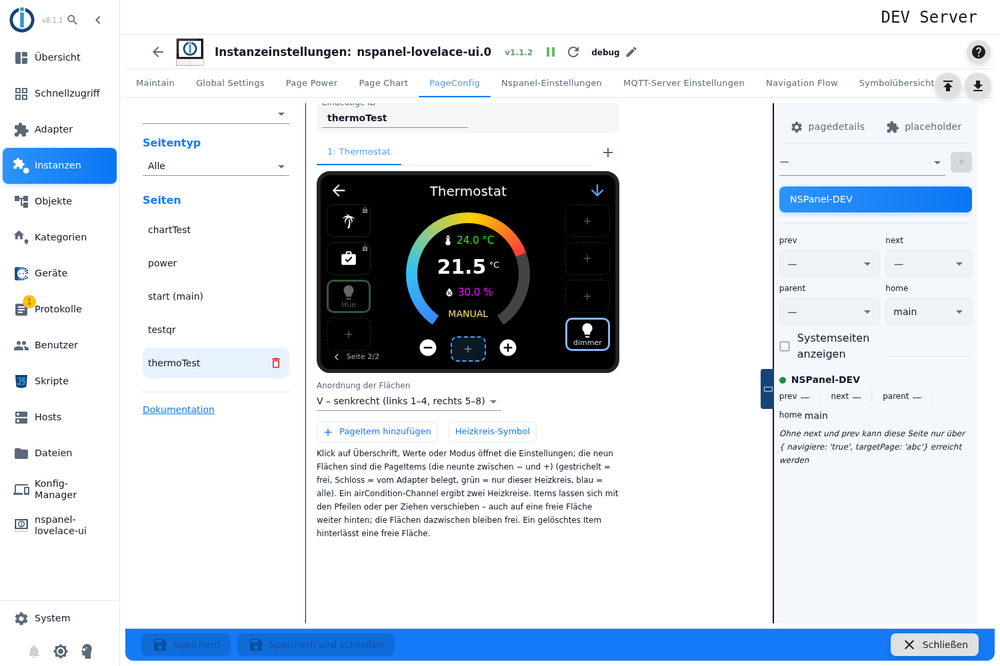

Hinweis zu Items für *alle Heizkreise*: Ihre Fläche kann je Heizkreis unterschiedlich sein, weil jeder Heizkreis unterschiedlich viele vom Adapter erzeugte Buttons davor hat. Der Editor zeigt immer die Belegung des gewählten Heizkreises.

## 9. Anordnung der Flächen

Auswahlfeld **Anordnung der Flächen** unter dem Panel (`sortOrder` im Skript):

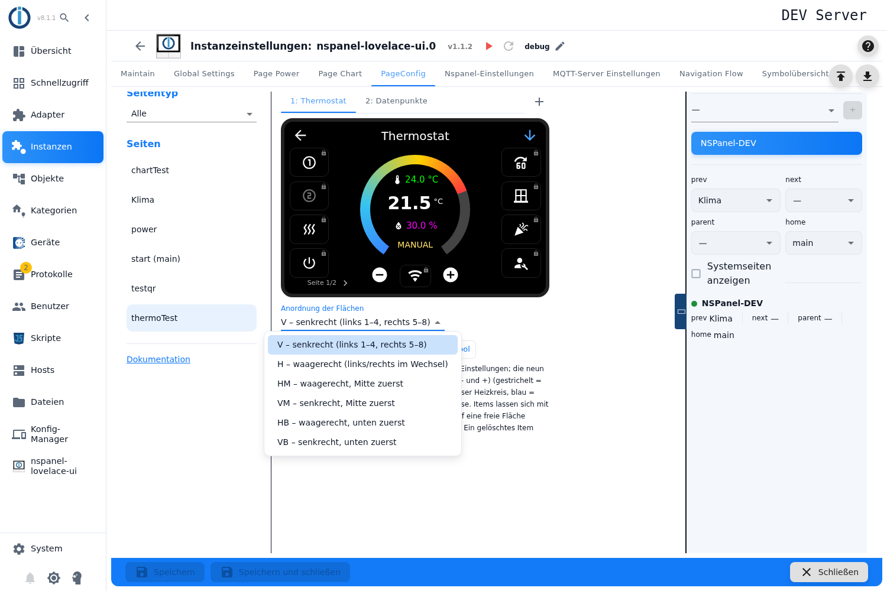

| Wert | Belegung |
|---|---|
| **V** – senkrecht | links 1–4, rechts 5–8 (Standard) |
| **H** – waagerecht | links/rechts im Wechsel |
| **HM** – waagerecht, Mitte zuerst | |
| **VM** – senkrecht, Mitte zuerst | |
| **HB** – waagerecht, unten zuerst | |
| **VB** – senkrecht, unten zuerst | |

Der Editor zeichnet die Flächen in der gewählten Anordnung. Bei allen Werten außer **V** sortiert der Adapter nur die acht seitlichen Flächen – die neunte (zwischen − und +) bleibt dann leer; der Editor zeigt sie gedimmt mit einem Hinweis.

## 10. Speichern, Panel-Zuweisung, Navigation

- Rechts im Bereich **Navigation/Panel** das Panel zuweisen und die Navigation (`prev`, `next`, `parent`, `home`) setzen – wie bei den anderen Seitentypen. Ohne `next`/`prev` ist die Seite nur über eine Navigation (`targetPage`) erreichbar.
- Unten **Speichern** bzw. **Speichern und schließen**. Die Instanz startet danach neu und baut die Seite auf.

## 11. Wenn etwas nicht wie erwartet aussieht

- **Alles ausgegraut:** Die Instanz läuft nicht. Der Editor ist nur bei laufender Instanz bedienbar.
- **Ein Button fehlt auf dem Panel, obwohl der Datenpunkt existiert:** Für `VACATION` und `USERICON` sucht der Adapter nicht nach der Rolle, sondern nach dem Datenpunkt mit **genau diesem Namen** unter dem Channel (z. B. `….VACATION`, nicht `….Vacation`). Die Vorschau im Heizkreis-Dialog zeigt nur die Buttons, die der Adapter wirklich erzeugt.
- **Items erscheinen an anderer Stelle als im Editor:** Prüfen, ob das Item an *alle Heizkreise* gebunden ist (siehe Hinweis in [PageItems](#8-pageitems-anlegen-verschieben-freie-flächen)) und ob die Anordnung ungleich **V** ist (neunte Fläche).
- **Die Seite zeigt nichts an:** Mindestens ein Heizkreis mit Datenquelle ist nötig.
