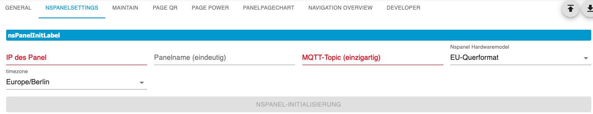
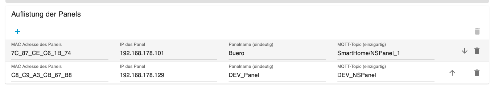
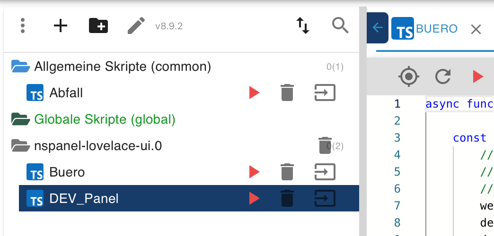

## Basic Settings (MQTT)
In the `General` tab, MQTT must be configured and the PIN for the service pages must be assigned.  

  - When using the internal MQTT server (**from the adapter**), it is possible to automatically fill in the data using the button. This function also searches for a free port to avoid problems with other adapters (e.g. Shelly, Sonoff). **All** MQTT settings in Tasmota are overwritten and adapted to the **Adapter MQTT server**.  
  - When using an external MQTT server (mosquitto or MQTT adapter), the fields below must be filled in accordingly.  
    - IP to external MQTT server -> For the MQTT adapter, enter the ioBroker IP.  
    - MQTT port -> make sure that the port is not already used by another adapter or service.  
    - Username and password -> with which Tasmota (Panel) must log in to the server.  

  
  - after saving, you can switch to the `Panel Settings` page. 

## Panel Settings  
  
    
  
- the IP address, if possible set a fixed IP in the router  
- assign a name for the panel  
- the MQTT topic under which the panel listens  
- the panel type [EU, US-P, US-L]  
- select time zone  

Finally, click the `NSPanel Initialization` button.  
The MQTT data and Tasmota settings are sent to the panel and all settings are set correctly. Furthermore, the Berry driver is installed, as well as the NSPanel firmware (approx. 10 minutes).  
After initialization, the panel is automatically entered in the list.  

  
_Do not execute information_
With the Tasmota tools, which are mainly available for troubleshooting, the Berry driver and the TFT firmware can be installed/reinstalled. For this, the IP/Panel is selected in the `Panel IP` field. Additionally, it is possible to restart Tasmota and jump to the Tasmota WebUI. (new window / popup) 

_continue from here_
Then save the settings and close the admin once. Then you can continue with the [Maintain page](#maintain).

## Maintain  

  

On the `Maintain` page, select the panel and create the current version of the config script via the `Script` button. It is saved in the JavaScript adapter in a folder with the name of the adapter instance. The filename matches the panel name. The other settings are explained in the chapter [**Adapter Admin** / Maintain](Maintain).  

- the config script 

[Example Configuration Script](https://github.com/ticaki/ioBroker.nspanel-lovelace-ui/blob/main/script/example_sendTo_script_iobroker.ts)
  
Now start the script once (it terminates itself again) and restart the instance. If everything was done correctly, the service page should now appear on the panel.  
Further explanations about this script can be found here. [**Configuration Script** / Introduction](ScriptConfig)  

If you have questions, ask - Discord, Forum, here, Telegram, Teams - everything is available :)