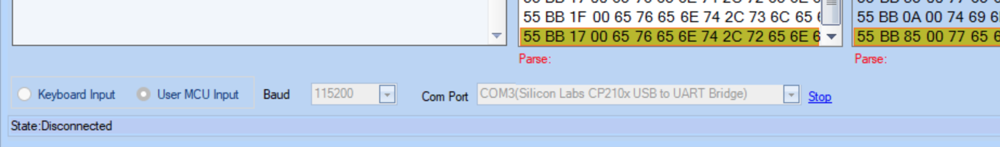

# Try the ioBroker Script even without NSPanel

## Introduction

If you have already permanently installed your NSPanel and then need to configure a new page, for example, you are constantly running back and forth between your computer and the panel to test the functionality. The movement as such may be good for you, but here it is not conducive to the efficiency in developing the new page.
Even after an update of the ioBroker script, you can simply test in the emulator with this solution whether everything still works before updating the script in your live instance.
And last but not least, this possibility is also interesting for all those who don't have an NSPanel yet, but would like to test it before buying.

  

## Requirements

You need:  
* a PC (I have currently tested it with Windows 11)  
* an ESP32 with Tasmota32  
* the Nextion Editor  
* and an ioBroker installation.  

  

> The ESP32 remains connected to the USB port of the PC with a data cable.

## Preparations

After your ESP32 has arrived, you must connect it to the PC via USB. I had to install the appropriate driver for my ESP32 (CP210x_Universal_Windows_Driver). After I installed the driver, a _Silicon Labs CP210x USB to UART Bridge_ on _COM3_ appears in the device manager under connections.  

Now we install Tasmota on the ESP via the web installer: To do this, you call up the page https://tasmota.github.io/install/ in the browser. According to Tasmota documentation, you must use the Edge or Chrome browser for this. There you select _ESP32_ in the selection menu on the right and _Tasmota DE_ in the selection menu on the left. Then you click on _CONNECT_ and select the COM port of your CP210x USB to UART Bridge.  

Nachdem die Verbindung hergestellt wurde, installiert ihr Tasmota auf dem EPS32. War die Installation erfolgreich, könnt Ihr im nächsten Schritt Eure WLAN-Daten eintragen.  
Nachdem die WLAN-Daten hinterlegt sind, gelangt Ihr mit einem weiteren Klick direkt auf die Tasmota Seite vom Gerät. War dies Erfolgreich, schließen wir die Tasmota Installation Seite und trennen kurz die USB Verbindung.  

Nachdem nun der ESP wieder erreichbar ist, prüft man in den Settings unter _Gerät konfigurieren_, ob RX (GPIO3) und TX (GPIO1) auf none stehen.

   

Anschließend könnt Ihr Tasmota und MQTT über den Admin des Adapter einstellen. Da zu volgt ihr der Anleitung bis zu dem Punkt, wo ihr den Button für NSPanel Initzialisierung drückt. [Link zur Anleitung](Adapter-Installation.md#grundeinstellung)  

## Berry-Driver für Emulation  
**ACHTUNG:** Nicht den Berry Treiber hier aus dem Wiki nehmen, sondern hier aus dem nachfolgenden Link  

Zuerst ladet ihr euch diese Datei aus Gihub [tasmota/Emulator/autoexec.be](https://github.com/ticaki/ioBroker.nspanel-lovelace-ui/blob/main/tasmota/Emulator/autoexec.be) herrunter.

  

Wenn das Panel in der Liste angezeigt wird, muss der Berry Treiber von Hand installiert werden. 
Dazu wechselt ihr wieder auf euren ESP32 Chip und geht auf "Werkzeuge -> Dateisystem verwalten"  

  

Sollte jetzt wie im Bild zusehen ist, schon eine autoexec.be enthalten sein löscht diese mit dem Flammen Symbol.  
Mit dem Button "Datei auswählen" wählt ihr die geladene Datei aus und mit klick auf `Upload` wird sie auf den Chip geladen.  

Nachdem die autoexec.be erstellt wurde, den ESP32 einmal rebooten.

## Installation des Nextion Editor

Zunächst braucht man noch den Nextion Editor: 
> https://nextion.tech/nextion-editor/  

sowie die HMI-Datei hier aus dem Repository (liegt im Verzeichnis HMI). Nachdem der Editor installiert ist, diesen Starten und die Datei nspanel.hmi im Nextion Editor öffnen. Anschließend im Editor oben auf Debug klicken. Es öffnet sich ein neues Fenster. Dort unten links von _Keyboard Input_ auf _User MCU Input_ umstellen, den COM-Port des ESP auswählen und die Baud-Rate auf 115200 stellen. Mit Start verbindet man sich nun zum ESP.

    

Nun kann das DEV-Skript im ioBroker ausgeführt werden. Hat man alles richtig gemacht, erscheint nach kurzer Zeit die erste Seite im Nextion Editor.

Nun hab Ihr ein vollständig klickbares, emuliertes NSPanel, in welchem Ihr eure neuen Pages ohne Zugriff auf Euer echtes Panel bequem entwerfen und vertesten könnt. Wenn man dann mit seinen Änderungen zufrieden ist, kann man die Änderungen vom Skript nun in das Produktionsskript eintragen!

## Hinweise

**Noch ein paar Hinweise**:  
* Die ESP32 Temperatur mit setOptions146 1 einschalten.  
  
* Im Gengensatz zum "echten" NSPanel hat der Emulator-ESP32 keinen eingebauten Temperatursensor und auch keine eingebauten Buttons/Relais. Es kann somit keine Daten hierfür in die Datenpunkte transportieren. Um Fehler zu vermeiden, sollte im Datenpunkt:
`0_userdate.0.NSPanel.Dev.Sensor.ANALOG.Temperature`
ein Temperaturwert für die Raumtemperatur (z.B. 21) eingetragen werden.

* Ebenfalls sind die Werte für die Status Icons im Screensaver nicht vorhanden. Da der Emulator in der Regel ein bereits  vorhandenes physisches NSPanel emuliert, können die MQTT-Pfade für die Relais-Icons auch auf das physische NSPanel verweisen.

**Viel Spaß mit dem Emulator!**