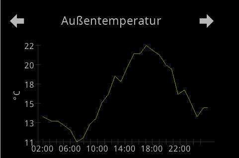
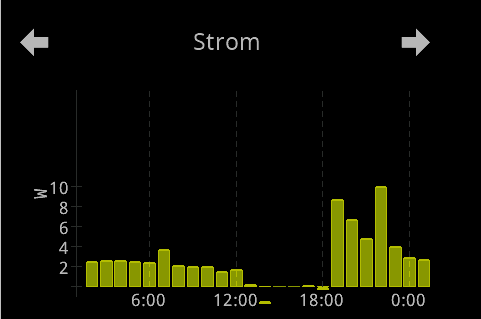
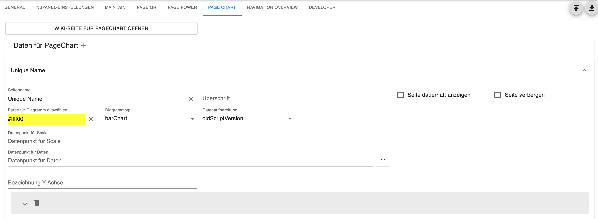
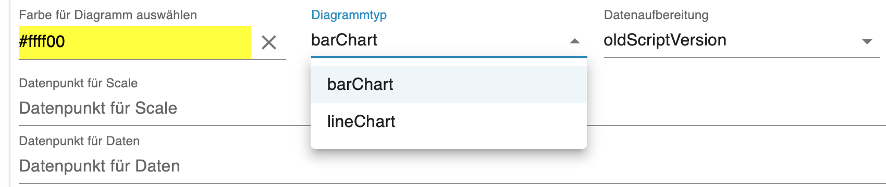
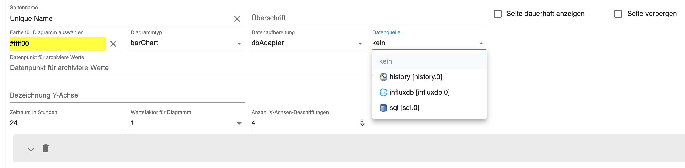

# PageChart  
  
The PageChart enables two types of chart display: Bar and Line. You can choose whether the data is prepared externally and made available via data points as in the old script, or whether an adapter is used for data storage. Currently SQL, InfluxV2 and History are supported.  

   

## Basic Settings  
  
  
  
By selecting the `PageChart` tab you get to the settings. To create a new page, click on the PLUS sign and the data fields for the page will appear. (see image above)  
1. First you define the page name, which must not be repeated in the entire panel. It is the ID for this page and is identical to the `uniqueName`. The name also appears in the gray bar, so you can easily distinguish between multiple pages.
2. Set the heading on the page.
3. If you check `alwaysOnDisplay`, the page remains permanently visible and does not automatically jump to the screensaver. For the screensaver to become active again, you must jump to another page.  
4. Option `Hide page` allows you to remove the page from navigation when the `hide Page` option is active in the service page `System`.  
5. with the color field you can set the color of the line/bars.  
6. select the type, barChart -> bars and lineChart -> lines  
  
7. Data source `oldScriptVersion` or `dbAdapter`  
  

    - **oldScriptVersion** -> the values for scale and data must be prepared externally. They match the schema from the NSPanel script. Only the data points for scale and data need to be entered. In the wiki of the NSPanel script there are examples of JavaScript that read data from a database and write it prepared into the data points for scale and data.  
    - **dbAdapter** -> If you save data to a database with a database adapter, you can select the instance of the adapter in the `Data source` field. In the `Data point for archived values` field, the same data point must be selected that was also configured in the adapter.  
        - Set time period in hours,
        - Every how many hours a line comes to the X-axis,
        - with bar chart a factor is selected to meaningfully display large values on the display 
        - Every how many hours a scale value should be written to the X-axis 
8. the designation of the Y-axis, e.g. the unit  
  
## Reference in Config Script
```typescript
// LineChart
    const temperatur: ScriptConfig.PageChart = {
        uniqueName: 'temperatur',
        type: 'cardLChart'
    }

// Balkenchart
    const stromChart: ScriptConfig.PageChart = {
        uniqueName: 'strom',
        type: 'cardChart'
    };
```
