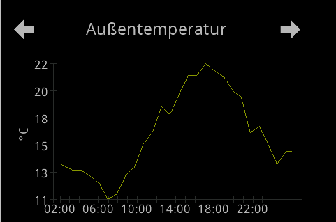
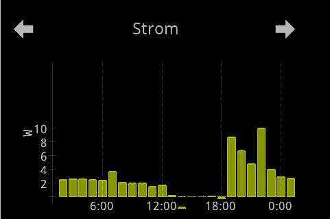
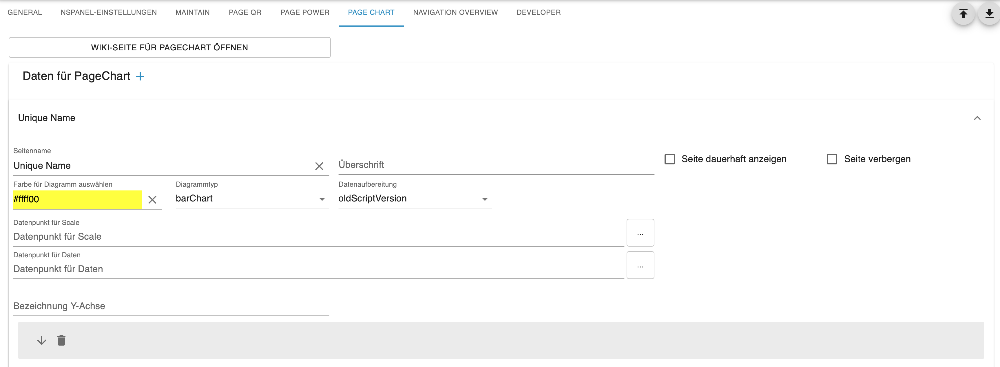
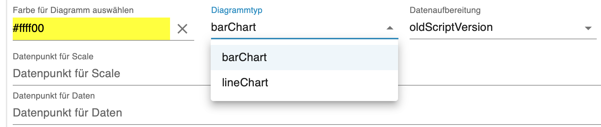
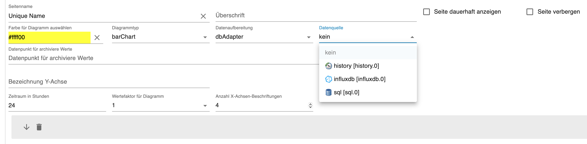

# PageChart

The PageChart offers two views: bars (`cardChart`) and a line (`cardLChart`). The data comes either from two states that a script prepares (scale and values, as with the old NSPanel script) or directly from a database adapter. SQL, InfluxDB (V2) and History are supported.

 

A chart page can be created in two ways — both give the same result on the panel:

1. **Tab `PageConfig`** (recommended): create a page of type `Chart`, configure everything in the editor, assign the navigation in the panel section. No script needed.
2. **Classic**: tab `PageChart` plus a reference in the configuration script (see below).

## Creating a chart in the `PageConfig` tab

In the `PageConfig` tab click the PLUS on the left, choose the type `Chart` and enter a unique page name (`uniqueName`, it must be unique across the whole panel). The editor then shows:

1. **Chart type**: column chart or line chart.
2. **Headline** of the page.
3. **Color** of the line or the bars.
4. **Data formatting**:
    - **Script version** → scale and values are prepared externally (schema of the NSPanel script). Only the two states `Data point for ticks` and `Data point for values` are needed. The wiki of the NSPanel script has example JavaScripts that read a database and write the prepared data into these states.
    - **Database adapter** → choose a running instance of `sql`, `influxdb` or `history` under `data source` (stored in the short form, e.g. `influxdb.0`). Under `data point for values from the database` choose the state that is logged by this instance. In addition:
        - `Range in hours` — how far back from now (default 24),
        - `X-axis ticks` (line only) — every how many hours a tick is drawn on the x-axis (default 2),
        - `Factor for card chart` (bar only) — divides large values so they fit the display,
        - `X-axis labels` — every how many hours a time label is written to the x-axis (default 4).
      An empty number field means: the adapter uses the default.
5. **Y-axis label**, e.g. the unit.

The fields can only be edited while the adapter instance is running. Visibility (`hide page`), `alwaysOn` and the navigation are set like for every page in the navigation / panel assignment section.

The adapter fetches the data as one average per hour for the bar chart and as averages on a 5-minute grid (at most 500 points) for the line chart, each over the configured range. Line values keep one decimal.

## Classic: tab `PageChart` and configuration script



The tab `PageChart` holds the settings. Click the PLUS to create a new page; the fields of the page appear (see picture above).
1. First set the page name; it must be unique across the whole panel. It is the ID of the page and identical to the `uniqueName`. The name is also shown in the grey bar, so several pages are easy to tell apart.
2. Set the headline of the page.
3. With `alwaysOnDisplay` checked the page stays visible and does not fall back to the screensaver automatically. To activate the screensaver again, switch to another page.
4. `hide page` removes the page from the navigation when `hide Page` is active on the service page `System`.
5. The color field sets the color of the line/bars.
6. Choose the type, barChart -> bars and lineChart -> line

7. Data source `oldScriptVersion` or `dbAdapter` — the fields mean the same as in the `PageConfig` tab above

8. The label of the y-axis, e.g. the unit

The page is then referenced in the configuration script; the `uniqueName` must match the page name in the tab:

```typescript
// line chart
    const temperatur: ScriptConfig.PageChart = {
        uniqueName: 'temperatur',
        type: 'cardLChart'
    }

// bar chart
    const stromChart: ScriptConfig.PageChart = {
        uniqueName: 'strom',
        type: 'cardChart'
    };
```
