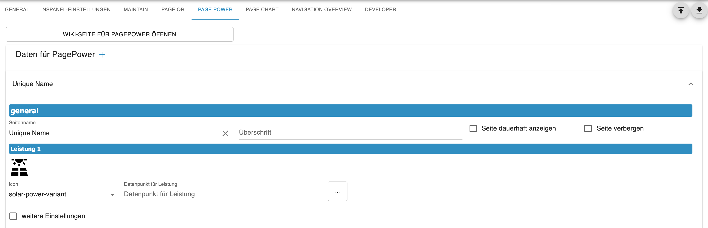
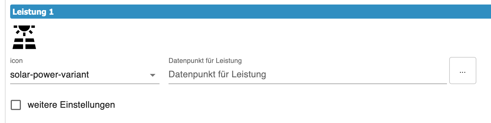
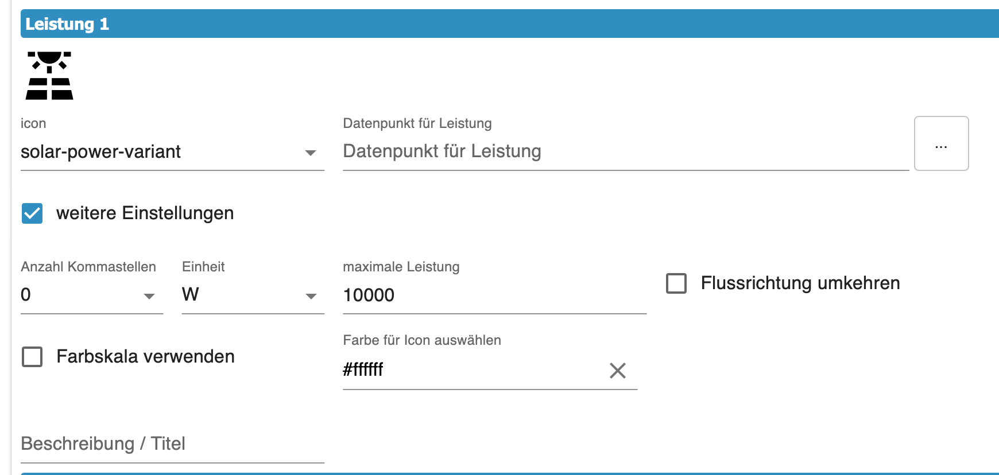
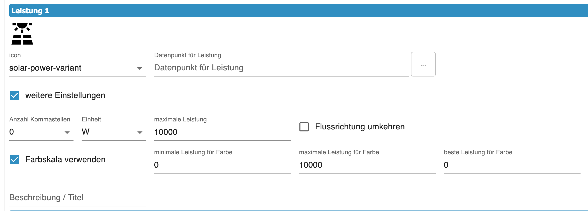
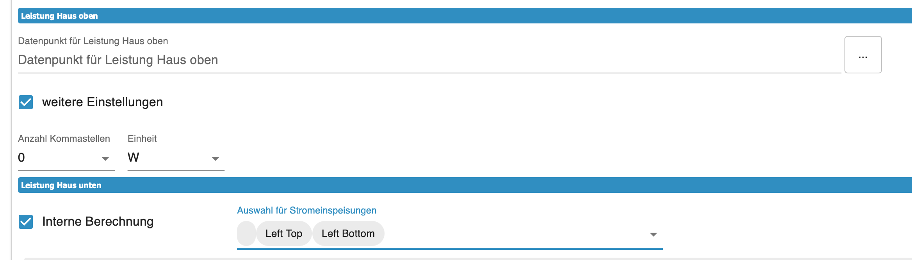

# PagePower  
  
**Content**
+ [Basic Settings](#basic-settings)  
    + [Producers / Consumers](#producers--consumers)  
    + [Home ](#home)    
+ [Reference in Config Script](#reference-in-config-script)   

The PagePower enables up to 6 consumers / producers to be displayed and calculated. It should map the power distribution in your smart home. Icons, color gradients, speed of flow direction as well as the flow direction itself can be set here. We explain the setting options with an example. You can create multiple of these pages. On which panel you then use them is decided in the config script of the respective panel.  
  
---
## Basic Settings  
  
   
   
By selecting the `PagePower` tab you get to the settings. To create a new page, click on the PLUS sign and the data fields for the page will appear. (see image above)  
1. First you define the page name, which must not be repeated in the entire panel. It is the ID for this page and is identical to the `uniqueName`. The name also appears in the gray bar, so you can easily distinguish between multiple pages.
2. Set the heading on the page.
3. If you check `alwaysOnDisplay`, the page remains permanently visible and does not automatically jump to the screensaver. For the screensaver to become active again, you must jump to another page.  
4. Option `Hide page` allows you to remove the page from navigation when the `hide Page` option is active in the service page `System`.
  
---  
## Producers / Consumers  
  
  

+ **Icon** -> via the select field an icon can be selected, the selective search supports you and suggests variants.  
+ **Data point for power** -> select the data point that contains the power (watts)   
  
   
   
 + **Anzahl der Dezimalstellen**, die dargestellt werden sollen, unabhängig von der Anzahl im Datenpunkt  
 + **Einheit** Hiermit wird die kleinste darzustellende Einheit ausgewählt. Durch die AutoUnit-Funktion wird die Einheit erhöht, wenn die Zahl vierstellig wird. z.B 999W werden bei Erhöhung zu 1kW. Wenn im Datenpunkt eine Einheit definiert ist, ist diese führend und überschreibt diese hier im Admin.  
 + **maximale Leistung** -> den maximalen Wert eintragen der vom Datenpunkt zu erwarten ist. Der max-Wert bedeutet 100% Geschwindigkeit der Anzeige für die Flussrichtung. Bei 0W bleibt der Punkt stehen und wird bei Erhöhung der Leistung prozentual dann schneller.  
 + Durch setzen des Haken kann die **Flußrichtung umgekehrt** werden. Alle Erzeuger sollten zur Mitte fließen und Verbraucher davon weg. Die Mitte der Seite spiegelt den Verteilerkasten wieder, wo alle Verbraucher und Erzeuger zusammen kommen.  
 + **Iconfarbe** -> mit dem ColorPicture kann die Farbe des Icon ausgewählt werden. Soll das Icon nach Höhe der Leistung seine Farbe ändern, dann aktiviert `Farbskale verwenden`.  
   
 

Mit den Werten `min Leistung`, `max Leistung`, `best Leistung` wird der Farbverlauf von Grün nach Rot festgelegt. Es gibt mehrere Möglichkeiten den Verlauf einzustellen. Welcher Wert Grün ist entscheidet der Wert von `best Leistung`.
+ **Beispiel 1**  
    0W soll grün sein und 100W Rot  
    + `min Leistung` = 0
    + `max Leistung` = 100  
    + `best Leistung` = 0
  
 + **Beispiel 2**  
    0W soll Rot sein und 100W Grün  
    + `min Leistung` = 0
    + `max Leistung` = 100  
    + `best Leistung` = 100
  
 + **Beispiel 3**  
    -50W soll Rot sein 0W ist Grün und 100W wieder Rot
    + `min Leistung` = -50
    + `max Leistung` = 100  
    + `best Leistung` = 0  
  
Mit **Beschreibung/Titel** könnt ihr über der Flussanzeige einen Text einblenden z.B. welcher Verbraucher das ist.

---  
### Home  

  
  
Home ist der mittlere Teil der Page, hier laufen alle Leistungen zusammen. Es ist der virtuelle Stromkasten mit seinem Zähler. Es gibt hier zwei Felder die Ihr nutzen könnt um Werte anzeigen zu lassen.  

+ `Haus oben` ist der Wert über dem Haus-Symbol. Ihr legt den Datenpunkt fest den ihr anzeigen wollt und könnt über `weitere Settings` zusätzlich noch Dezimalstellen und Einheit auswählen. Hier gilt auch das der Admin die Einheit vom Datenpunkt überschreibt.  
+ `Haus unten` hat zwei Funktionen. Wenn `interne Berechnung` nicht aktiv ist, dann gleicht es dem Feld `Haus oben`. Bei Aktivierung könnt ihr über `Auswahl Stromeinseisungen` die Felder auswählen, die euer Smarthome versorgen (z.B. Stromnetz, Batterie, Solarpanel)  
---  
## Verweis im Konfig Script
Im Konfig Script wird die Seite wie folgt eingebunden.  
Als Hauptseite unter pages
```typescript
    const powerGrid: ScriptConfig.PagePower = {
        uniqueName: 'seitenname', // muss mit dem Namen im Admin übereinstimmen
        type: 'cardPower'
    };
```  

Als Subpage unter subPages  
```typescript
    const energieAnzeige: ScriptConfig.PagePower = {
        prev: 'uniqueName einer Seite',
        home: 'main',
        uniqueName: 'seitenname', // muss mit dem Namen im Admin übereinstimmen
        type: 'cardPower'
    };
```  
Unter pages bzw subPages wird der Name, der hinter `const` steht eingetragen.  
```typescript
        // Seiteneinteilung / Page division
        // Hauptseiten / Mainpages
        pages: [
            powerGrid,
        ],
        // Unterseiten / Subpages
        subPages: [
            energieAnzeige,
        ],
```  

> [!Note]  
> Zuerst die Settings im Admin durchführen und danach das Script anpassen und neu starten.