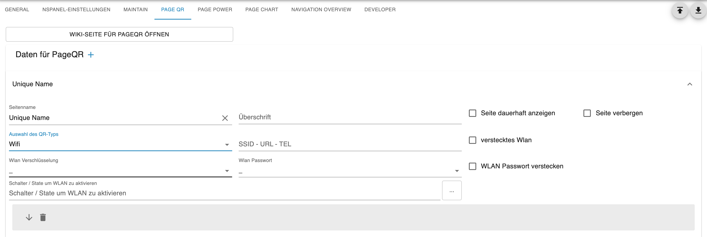
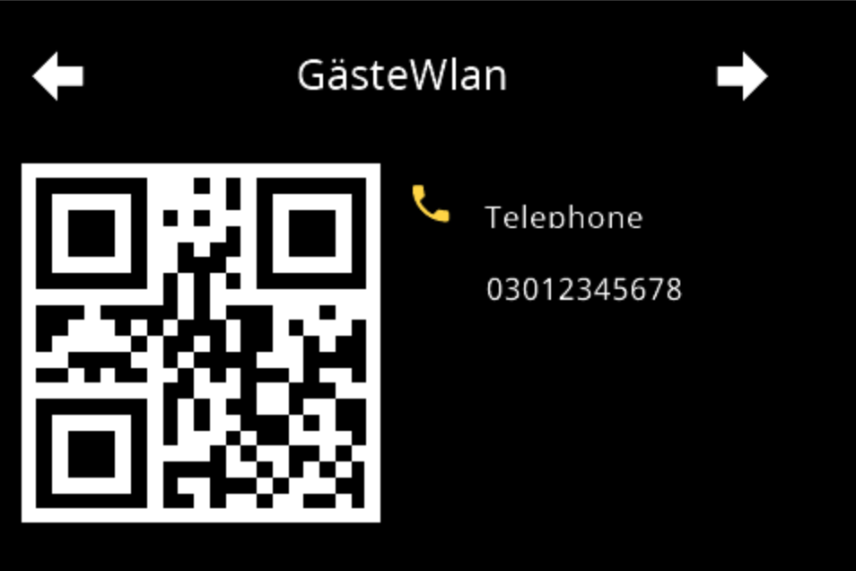
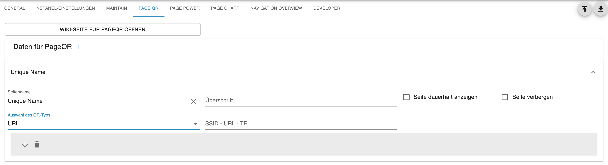

# PageQR  
**Content**  
+ [Settings in Admin](#settings-in-admin)  
    + [Type Wifi](#wifi)  
    + [Type Phone](#phone)  
    + [Type URL](#url)  
+ [Reference in Config Script](#reference-in-config-script)  

The PageQR generates a QR code on the panel that can be scanned with a mobile phone, for example. This allows data for guest WiFi, a phone number, or a URL to a website to be transmitted. You can create multiple of these pages. On which panel you then use them is decided in the config script of the respective panel.  

---  
## Settings in Admin
  
  
By selecting the `PageQR` tab you get to the settings. To create a new page, click on the PLUS sign and the data fields for the page will appear. (see image above)  
1. First you define the page name, which must not be repeated in the entire panel. It is the ID for this page and is identical to the `uniqueName`. The name also appears in the gray bar, so you can easily distinguish between multiple pages.
2. Set the heading on the page.
3. If you check `alwaysOnDisplay`, the page remains permanently visible and does not automatically jump to the screensaver. For the screensaver to become active again, you must jump to another page.  
4. Option `Hide page` allows you to remove the page from navigation when the `hide Page` option is active in the service page `System`.  
5. Selection of the QR type. There are currently three types: Wifi, Phone and URL. 
  
### Wifi  
  
For the Wifi type, the following additional fields are available.  

- **SSID - URL - TEL** -> Here the name of the WiFi is entered  
- **WlanHidden** -> Check if you have a hidden WiFi  
- **WlanVerschlüsselung** -> select the encryption of your WiFi  
- **Password** -> at the end of the page there are three password fields, here you select which one you want to use. If you don't select any, there is no password in the QR code.  

> [!Note]  
>The password is stored encrypted in the adapter  
  
- **Hide WiFi password** -> this hides the password on the page in the panel, but it is still in the QR code  
- **Switch/State** -> here a data point of type boolean can be entered or selected with the small button on the right.  

> [!Note]  
> If the data point is stored, a switch is shown in the panel at the password position. With this the data point is then set to true / false.  

  

---  

### PHONE  
  
  
For the TEL type, a phone number can be embedded in the code. After scanning with the mobile phone, you can dial it directly. To remain international, the number should start with the country code, e.g. +49 for Germany.  

  

---  

### URL
  
Hier bei handelt es sich um den klassischen QR-Code wie er in jeder Werbung zu finden ist. Im Code verbirgt sich eine URL - die nach dem Scan aufgerufen werden kann. z.B. https://github.com/ticaki/ioBroker.nspanel-lovelace-ui/wiki/PageQR  

  
  
---  

## Verweis im Konfig Script
Im Konfig Script wird die Seite wie folgt eingebunden.  
Als Hauptseite unter pages
```typescript
    const wlandaten: ScriptConfig.PageQR = {
        uniqueName: 'seitenname', // muss mit dem Namen im Admin übereinstimmen
        type: 'cardQR'
    };
```  

Als Subpage unter subPages  
```typescript
    const telefon: ScriptConfig.PageQR = {
        prev: 'uniqueName einer Seite',
        home: 'main',
        uniqueName: 'seitenname', // muss mit dem Namen im Admin übereinstimmen
        type: 'cardQR'
    };
```  
Unter pages bzw subPages wird der Name, der hinter `const` steht eingetragen.  
```typescript
        // Seiteneinteilung / Page division
        // Hauptseiten / Mainpages
        pages: [
            wlandaten,
        ],
        // Unterseiten / Subpages
        subPages: [
            telefon,
        ],
```  

> [!Note]  
> Zuerst die Settings im Admin durchführen und danach das Script anpassen und neu starten.