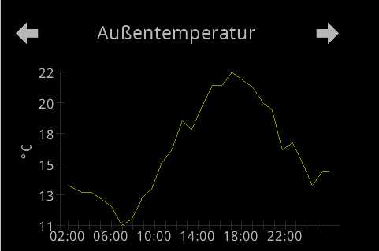
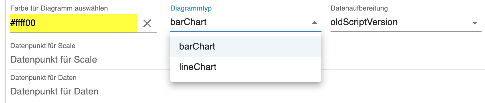

<!-- TODO: Translate from German to Español -->

# PageChart  
  
Die PageChart ermöglicht zwei Darstellungen von Chart, Blaken und Line. Es kann ausgewählt werden, ob die Daten extern aufbereitet werden und wie beim alten Script per Datenpunkte zur Verfügunggestellt werden oder ein Adapter zur Datenspeicherung genutzt wird. Aktuell wrid SQL, InfluxV2 und Hinstory unterstüzt.  

   

## Grundeinstellungen  
  
  
  
Mit Auswahl des Tab `PageChart` kommt ihr an die Einstellungen. Um eine neue Page zu erstellen, klickt ihr auf das PLUS-Zeichen und es erscheinen die Datenfelder für die Page. (siehe Bild oben)  
1. Zuerst legt ihr den Seitennamen fest, dieser darf sich im gesamten Panel nicht wiederholen. Es ist die ID für diese Seite und ist identisch mit dem `uniqueName`. Der Name erscheint auch in dem grauen Balken, dadruch könnt ihr bei mehreren Seiten sie leicht unterscheiden.
2. Die Überschrift auf der Seite festlegen.
3. Wenn ihr den Haken bei `alwaysOnDisplay` setzt, bleibt die Seite permanent sichtbar und spring nicht automatisch in den Screensaver. Damit der Screensaver wieder aktiv wird, müsst ihr auf eine andere Seite springen.  
4. Option `Seite ausblenden` ermöglicht die Seite aus der Navigation zu entfernen, wenn in der Serviceseite `System`die Option `hide Page` aktiv ist.  
5. mit dem Farbfeld kann die Farbe der Line/Balken festgelegt werden.  
6. den Type auswählen, barChart -> Balken und lineChart -> Linen  
  
7. Datenherkunft `oldScriptVersion` oder `dbAdapter`  
  

    - **oldScriptVerion** -> hierbei müssen die Werte für Scale und Daten extern aufbereitet werden. Sie gleichen dem Schema vom NSPanel-Script. Es müssen nur die Datenpunkte für Scale und Daten eingetragen werden. Im Wiki vom NSPanel-Script gibt es Beispiele für Javascripte, die Daten aus einer Datenbank auslesen und aufbereitet in die Datenpunkte für Scale und Daten schreibt.  
    - **dbAdapter** -> Wenn ihr mit einem Datenbankadapter Daten in eine Datenbank sichert, könnt ihr im Feld `DatenQuelle`die Instanz des Adapter auswählen. Im Feld `Datenpunkt für archivierte Werte` muss der selbe Datenpunkt ausgewählt werden, welcher auch im Adapter konfiguriert wurde.  
        - Zeitraum festlegen in Stunden,
        - Alle wie viel Stunden ein Strich an die X-Achse kommt,
        - beim Balkenchart wird ein Factor ausgewählt, um große Werte sinnvoll auf dem Display darzustellen 
        - Alle wieviel Stnden ein Scalenwert an die X-Achse geschrieben werden soll 
8. die Bezeichnung der Y-Achse z.B. die Einheit  
  
## Verweis im Konfig Script
```typescript
// LineChart
    const temperatur: ScriptConfig.PageChart = {
        uniqueName: 'temperatur',
        type: 'cardLChart'
    }

// Balkenchart
    const stromChart: ScriptConfig.PageChart = {
        uniqueName: 'strom',
        type: 'cardChart'
    };
```
