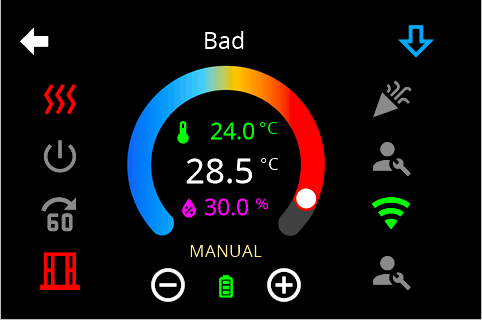
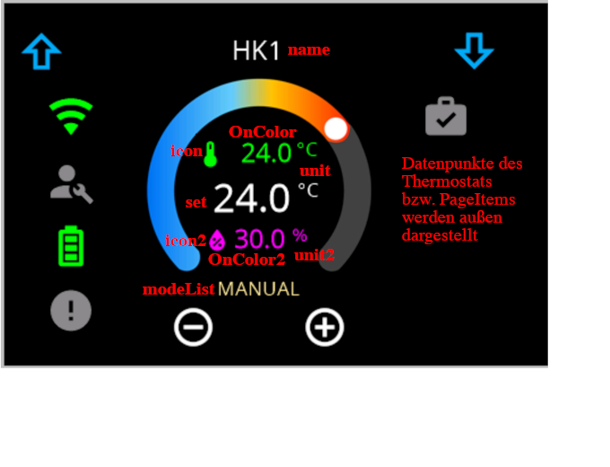
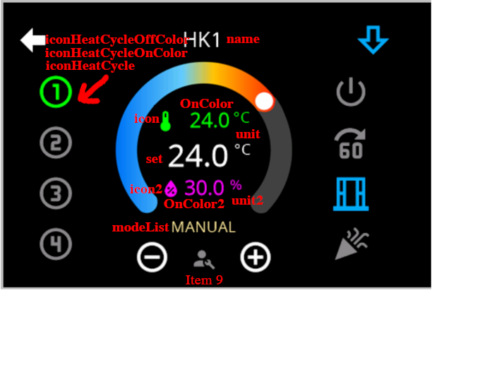

<!-- TODO: Translate from German to Español -->

# Page Thermo2  
  
Die PageThermo hat ein neues Design bekommen und zusätzliche Funktionen. Sie kann jetzt mehrere Heizkreise verwalten und zusätzlich zu den Datenpunkten des Thermostats normale PageItems aufnehmen, damit ist sie in Ihrer Konfiguratiion offener.

## Konfiguration der PageThermo2 im Adapter
Diese unterscheitet sich von der Skriptkonfiguration, daher eine komplette Beschreibung.
Struktur:
- [Aussehen](#aussehen)
- [Feature](#feature)
- [Probleme](#bekannte-probleme)
- [Konfiguration](#konfiguration)
    - [Alias](#alias)
    - [Direkt über Datenpunkte](#direkt-über-datenpunkte)
    - [Gemeinsame Optionen](#gemeinsame-eigenschaften)
- [PageItemerweiterung](#pageitemerweiterung) 

### Aussehen: 
 

### Feature:

- bis zu 8 Heizkreise möglich (z.B. Heizung/Klimaanlage oder Küche/Wohnzimmer/...)
- unendliche Anzahl an Pageitems (mit Blätterfunktion), das sind die 8 aussen rum und Nr. 9 zwischen dem + und -
- Pageitems können einem Heizkreis zu geordnet werden (automatisch erzeugt werden bei mehreren Heizkreisen immer einem zugewiesen)
- Überschriften sind per Heizkreis
- Die Zeilen ober und unterhalb der Einstelltemperatur sind frei definierbar mit icon, wert, unit

### Bekannte Probleme
- leichtes Flackern auf Grund der hübschen Optik - das wird bleiben
- Mode und Modeset könnten noch inkonsequent sein - in arbeit

### Konfiguration
Eine komplette Seite sieht im Skript z.B. so aus 

```typescript
    const ThermoNew: PageType = {
        type: 'cardThermo2',
        uniqueName:'main',
        heading: 'egal wird eh nicht angezeigt',
        thermoItems:[
            {name: 'test1', id:'0_userdata.0.Einzelne_Geräte.Thermostat'},
            {name: 'test2', modeList:['aus','kaputt', 'falsch'], modeId:'0_userdata.0.Einzelne_Geräte.Thermostat.MODE' ,iconHeatCycle:'home', iconHeatCycleOffColor:Red, thermoId1:'0_userdata.0.Einzelne_Geräte.Thermostat.ACTUAL', set:'0_userdata.0.Einzelne_Geräte.Thermostat.SET', thermoId2:'0_userdata.0.Einzelne_Geräte.Thermostat.HUMIDITY'}],
        items:[
            {id: 'alias.0.Licht.lights.Gerät_1', filter: 0},
            {id: 'alias.0.Licht.lights.Gerät_2', filter: 0},
            {id: '0_userdata.0.Einzelne_Geräte.dimmer'},
            {id: 'alias.0.NSPanel.allgemein.hue', },
            {navigate: true, targetPage: 'fahrplanrouten'},
            {id: 'alias.0.NSPanel.allgemein.shutter', filter: 1},
            {id: 'alias.0.NSPanel.allgemein.shutter', filter: 1},
            {id: 'alias.0.NSPanel.allgemein.shutter', filter: 1}
            ],
    }
```

#### Alias
Wie gewohnt kann man Aliase (siehe [Tabelle](https://github.com/ticaki/ioBroker.nspanel-lovelace-ui/blob/main/ALIAS.md)) verwenden. Die Role **airCondition** erzeugt 2 Heizkreise. Die wird eingestellt durch `name2`, `iconHeatCycle2`, `iconHeatCycleOnColor2` und `iconHeatCycleOffColor2`. Viele der optionalen Datenpunkte sind drin und werden Heizkreis bezogen als Pageitems hinzugefügt. Fehlende bitte reklamieren.
```typescript
    const Thermo2New: PageType = {
        type: 'cardThermo2',
        uniqueName:'Seitenname für interne Verwendung - Pflicht',
        heading: 'egal wird eh nicht angezeigt',
        thermoItems:[
            {
                name: 'Das hier ist die Überschrift', 
                id:'0_userdata.0.Einzelne_Geräte.Thermostat', // das hier ist der Channel, Device oder Folder
            },
        ],
        items:[],
    }
```
- `thermoItems` enthält Objekte ('{}') die die Heizkreise beschreiben minimum 1 (Liste bzw. Array)
  - `id` ist der Channel. (Zeichenkette)
  - `name` ist die Überschrift die angezeigt wird. (Zeichenkette) Ohne dieses wird geschaut, ob was im `common.name` des Channel steht.
  - `name2` ist die Überschrift, die für eine `airCondition` verwendet wird.
  - `iconHeatCycle2`: Überschreibt das Zahlenicon in den PageItems (außen herum) **ausschließlich für airCondition**
  - `iconHeatCycleOnColor2`: Überschreibt die Farbe für aktiviert in den PageItems (außen herum)  **ausschließlich für airCondition**
  - `iconHeatCycleOffColor2`: Überschreibt die Farbe für deaktiviert in den PageItems (außen herum)  **ausschließlich für airCondition**

Der Datenpunkt **MODE** hat sich verändert, daher bitte unten bei [modeList](#modelist) lesen

#### Direkt über Datenpunkte
Das ist mit Alias nicht mischbar, darf aber natürlich auf die Datenpunkte eines angelegten Channels verweisen. 
```typescript
const Thermo2New: PageType = {
        type: 'cardThermo2',
        uniqueName:'Seitenname für interne Verwendung - Pflicht',
        heading: 'egal wird eh nicht angezeigt',
        thermoItems:[
            {
                name: 'Das hier ist die Überschrift', 
                set:'0_userdata.0.Einzelne_Geräte.Thermostat.SET', // Der Einstellwert der Heizung
                thermoId1:'0_userdata.0.Einzelne_Geräte.Thermostat.ACTUAL', // Aktuelle Raumtemperatur (oberer Wert in der Anzeige)
                thermoId2:'0_userdata.0.Einzelne_Geräte.Thermostat.HUMIDITY', // Aktuelle Luftfeuchtigkeit (unterer Wert in der Anzeige)
                modeId:'0_userdata.0.Einzelne_Geräte.Thermostat.MODE', // Textfeld unterhalb der Werte - kein Zeichenkettendatenpunkt 
            }
        ],
        items:[],
    }
```
- `thermoItems` enthält Objekte ('{}') die die Heizkreise beschreiben minimum 1 (Liste bzw. Array)
  - `name` ist die Überschrift die angezeigt wird. (Zeichenkette)
  - `set` ist der Einstellwert der Heizung - aktuell keine Unterteilung in read/write
  - `thermoId1` Aktuelle Raumtemperatur (oberer Wert in der Anzeige)
  - `thermoid2` Aktuelle Luftfeuchtigkeit (unterer Wert in der Anzeige)
  - `modeId` Siehe beschreibung unten zu `modeList`

#### Gemeinsame Eigenschaften




Hier sind die Eigenschaften beschrieben die zusätzlich zu `name`, `id` bzw. `name`, `set` angegeben werden können und was sie bedeuten:

```typescript
        icon?: AllIcons | '';
        icon2?: AllIcons | '';
        iconHeatCycle?: AllIcons | ''; 
        iconHeatCycleOnColor?: RGB;
        iconHeatCycleOffColor?: RGB;     
        name?: string;
        minValue?: number;
        maxValue?: number;
        stepValue?: number;
        power?: string;
        unit?: string;
        unit2?: string;
        onColor?: RGB;
        onColor2?: RGB;
        modeList?: string[];
```

**icon:** Überschreibt das Standardicon in der 1. Textzeile (Temperatur)
**onColor:** Überschreibt die Farbe  der 1. Textzeile (Temperatur)
**unit:** Überschreibt die Einheit  der 1. Textzeile und 2. Textzeile (Temperatur) 

**icon2:** wie oben für Zeile 3 (Luftfeuchtigkeit)
**onColor2:**  wie oben für Zeile 3 (Luftfeuchtigkeit)
**unit2:** Überschreibt die Einheit  der 3. Textzeile (Luftfeuchtigkeit)

**iconHeatCycle:** Überschreibt das Zahlenicon in den PageItems (außen herum)
**iconHeatCycleOnColor:** Überschreibt die Farbe für aktiviert in den PageItems (außen herum) 
**iconHeatCycleOffColor:** Überschreibt die Farbe für deaktiviert in den PageItems (außen herum) 

**minValue:** minimale Einstellbare Temperatur (Default: 15) *im Admin einstellbar ob 10 = 1 °C oder 10 = 10 °C*
**maxValue:** maximal einstellbare Temperatur (Default: 28) *im Admin einstellbar*
**stepValue:** Schritte für +/-. Eine eingetragene 0.1 bedeutet Schritte von 0.1 (Default: 0.5)  *im Admin einstellbar*

**~~power~~:** Das wird aktuell über MODESET benutzt ist da ne 0 ist die anzeige "aus"

*im Admin einstellbar*: Es gibts auf der Seite `NSPanel-Einstellungen` ganz unten eine Option, ob man es kompatible zum Skript haben möchte oder natürlich.

### modeList 
**modeList:** Das denke ich ist noch nicht final und braucht deutlich mehr Text :)
`modeId` bzw. 'MODE' und `MODESET` arbeiten auf die dieselbe Weise. Der Datenpunkt sollte vom Type `number` sein und kann im Object `common.states` verwenden - dann arbeiten das `common.states` für `modeList`.
`modeList` überschreibt `common.states` und diese überschreibt die `Standardmodelist`, die im Adapter hinterlegt ist:  
  
Standard Modelist
```typescript
['OFF', 'AUTO', 'COOL', 'HEAT', 'ECO', 'FAN', 'DRY']
```
Im Datenpunkt steht z.B. eine 0 dann wird `OFF` angezeigt, steht dort eine 3 wird `HEAT` angezeigt (die Texte werden übersetzt).  
Wenn das in den `common.states` des Datenpunktes genauso steht, gilt dort das gleich. Ebenso in der modeList.  

Im Skript sieht dass dann etwas regional angepasst so aus:
```typescript
modeList: ["Aus'm", "Automat", "Kühl'n", "Heiz'n", "Sparn", "Puste", "Trockn"],
```


Ergänzend wurde TargetMode und CurrentMode aufgeteilt - siehe Alias Tabelle - das ist noch nicht final - wir würde gerne den CurrentMode unterhalb der Temperatur anzeigen mit `inaktiv, idle, heizen, kühlen`
Wenn MODE nicht angegeben ist wird es durch MODESET ersetzt. 
MODE: kann vom common.type = 'string' sein, dann wird einfach geschrieben was im Datenpunkt steht.

### PageItemerweiterung
Für die Pageitems gibt es eine neue Eigenschaft die aktuell aber nur für die cardThermo2 von belang ist:
```typescript
items:[
    {id: 'alias.0.Licht.lights.Gerät_1', filter: 0},
],
```
`filter:` Ist es definiert, wird das Pageitem nur angezeigt, wenn der entsprechende Heizkreis aktiv ist. Zählung beginnt bei 0 (number). 
**Wenn eine airCondition per 'id' hinzugefügt wird erhöht sich der index nach der airCondition um 1.**

Der Adapter unterstützt jetzt auch Platzhalter PageItems - durch `id:'delete'` oder `id:'empty'` werden diese definiert.


Schlußanmerkung - die Rollen für aircondition können sich noch ändern - die scheinen sich von thermostat zu unterscheiden also besser da nachgucken in der Alias-Tabelle.  
