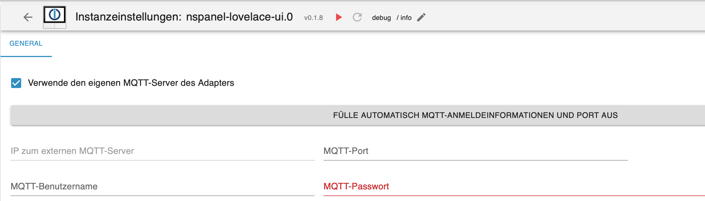

## Configuration de Base (MQTT)
Dans l'onglet `General`, MQTT doit être configuré et le PIN pour les pages de service doit être assigné.  

  - Lors de l'utilisation du serveur MQTT interne (**de l'adaptateur**), il est possible de remplir automatiquement les données en utilisant le bouton. Cette fonction recherche également un port libre pour éviter des problèmes avec d'autres adaptateurs (ex. Shelly, Sonoff). Toutes les paramètres MQTT dans Tasmota sont écrasés et adaptés au **serveur MQTT de l'adaptateur**.  
  - Lors de l'utilisation d'un serveur MQTT externe (mosquitto ou adaptateur MQTT), les champs ci-dessous doivent être remplis en conséquence.  
    - IP vers le serveur MQTT externe -> Pour l'adaptateur MQTT, entrer l'IP d'ioBroker.  
    - Port MQTT -> s'assurer que le port n'est pas déjà utilisé par un autre adaptateur ou service.  
    - Nom d'utilisateur et mot de passe -> avec lesquels Tasmota (Panel) doit se connecter au serveur.  

  
  - après sauvegarde, vous pouvez passer à la page `Paramètres du Panel`. 

## Paramètres du Panel  
  
    
  
- l'adresse IP, si possible définir une IP fixe dans le routeur  
- assigner un nom pour le panel  
- le topic MQTT sous lequel le panel écoute  
- le type de panel [EU, US-P, US-L]  
- sélectionner le fuseau horaire  

Enfin, cliquer sur le bouton `Initialisation NSPanel`.  
Les données MQTT et paramètres Tasmota sont envoyés au panel et tous les paramètres sont correctement définis. De plus, le pilote Berry est installé, ainsi que le firmware NSPanel (env. 10 minutes).  
Après l'initialisation, le panel est automatiquement inscrit dans la liste.  

  
_Ne pas exécuter les informations_
Avec les outils Tasmota, qui sont principalement disponibles pour le dépannage, le pilote Berry et le firmware TFT peuvent être installés/réinstallés. Pour cela, l'IP/Panel est sélectionné dans le champ `IP du Panel`. De plus, il est possible de redémarrer Tasmota et de passer à la WebUI Tasmota. (nouvelle fenêtre / popup) 

_continuer à partir d'ici_
Ensuite, sauvegarder les paramètres et fermer l'admin une fois. Ensuite, vous pouvez continuer avec la [page Maintain](#maintain).

## Maintain  

  

Sur la page `Maintain`, sélectionner le panel et créer la version actuelle du script de configuration via le bouton `Script`. Il est sauvegardé dans l'adaptateur JavaScript dans un dossier avec le nom de l'instance de l'adaptateur. Le nom du fichier correspond au nom du panel. Les autres paramètres sont expliqués dans le chapitre [**Admin de l'Adaptateur** / Maintain](Maintain).  

- le script de configuration 

[Script de Configuration d'Exemple](https://github.com/ticaki/ioBroker.nspanel-lovelace-ui/blob/main/script/example_sendTo_script_iobroker.ts)
  
Maintenant démarrer le script une fois (il se termine automatiquement) et redémarrer l'instance. Si tout a été fait correctement, la page de service devrait maintenant apparaître sur le panel.  
D'autres explications sur ce script peuvent être trouvées ici. [**Script de Configuration** / Introduction](ScriptConfig)  

Si vous avez des questions, demandez - Discord, Forum, ici, Telegram, Teams - tout est disponible :)

[Alias Tabelle](https://github.com/ticaki/ioBroker.nspanel-lovelace-ui/blob/main/ALIAS.md)  
