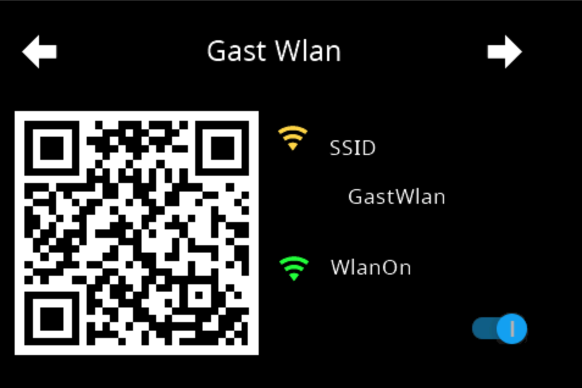

<!-- TODO: Translate from German to Français -->

# PageQR  
**Content**  
+ [Einstellungen im Admin](#einstellung-im-admin)  
    + [Type Wifi](#wifi)  
    + [Type Telefon](#telefon)  
    + [Type URL](#url)  
+ [Verweis im Konifg Script](#verweis-im-konfig-script)  

Die PageQR erzeugt auf dem Panel ein QR-Code, der mit dem Handy zum Beispiel gescannt werden kann. Damit können Daten für das GästeWlan, eine Telefonnummer oder eine URL zu einer Website übermittelt werden. Ihr könnt mehrere dieser Seiten anlegen. Auf welchem Panel ihr diese dann nutzt, entscheidet ihr im Konfig-Script des jeweiligen Panels.  

---  
## Einstellung im Admin
  
  
Mit Auswahl des Tab `PageQR` kommt ihr an die Einstellungen. Um eine neue Page zu erstellen, klickt ihr auf das PLUS-Zeichen und es erscheinen die Datenfelder für die Page. (siehe Bild oben)  
1. Zuerst legt ihr den Seitennamen fest, dieser darf sich im gesamten Panel nicht wiederholen. Es ist die ID für diese Seite und ist identisch mit dem `uniqueName`. Der Name erscheint auch in dem grauen Balken, dadruch könnt ihr bei mehreren Seiten sie leicht unterscheiden.
2. Die Überschrift auf der Seite festlegen.
3. Wenn ihr den Haken bei `alwaysOnDisplay` setzt, bleibt die Seite permanent sichtbar und spring nicht automatisch in den Screensaver. Damit der Screensaver wieder aktiv wird, müsst ihr auf eine andere Seite springen.  
4. Option `Seite ausblenden` ermöglicht die Seite aus der Navigation zu entfernen, wenn in der Serviceseite `System`die Option `hide Page` aktiv ist.  
5. Auswahl des QR-Typs. Es gibt aktuell drei Typen Wifi, Telefon und URL. 
  
### Wifi  
  
Beim Typ Wifi stehen folgende Felder zusätzlich zur Verfügung.  

- **SSID - URL - TEL** -> Hier wird der Name des Wlan eingeben  
- **WlanHidden** -> Haken setzen, wenn ihr ein verstecktes Wlan habt  
- **WlanVerschlüsselung** -> wählt die Verschlüsselung eures Wlan aus  
- **Password** -> am Ende der Seite gibt es drei Passwordfelder, hier wählt ihr aus welches ihr nutzen wollt. Wenn ihr keins auswählt, befindet sich auch kein Password im QR-Code.  

> [!Note]  
>Das Password wird verschlüsselt im Adapter gespeichert  
  
- **Wlan Passwort verstecken** -> damit wird das Password auf der Seite im Panel ausgeblendet, befindet sich aber trozdem im QR Code  
- **Schalter/State** -> hier kann ein Datenpunkt vom Typ boolean eingetragen werden bzw. mit den kleinen Button rechts ausgewählt werden.  

> [!Note]  
> Wenn der Datenpunkt hinterlegt ist, wird im Panel an der Stelle des Passwortes ein Schalter eingeblendet. Mit diesem wird dann der Datenpunkt auf true / false gesetzt.  

  

---  

### TELEFON  
  
  
Beim Type TEL kann eine Telefonnummer in den Code eingebettet werden. Nachdem scannen mit dem Handy, kann man diese direkt wählen. Um International zu bleiben, sollte die Nummer mit der Ländervorwahl beginnen z.B. +49 für Deutschland.  

  

---  

### URL
  
Hier bei handelt es sich um den klassischen QR-Code wie er in jeder Werbung zu finden ist. Im Code verbirgt sich eine URL - die nach dem Scan aufgerufen werden kann. z.B. https://github.com/ticaki/ioBroker.nspanel-lovelace-ui/wiki/PageQR  

  
  
---  

## Verweis im Konfig Script
Im Konfig Script wird die Seite wie folgt eingebunden.  
Als Hauptseite unter pages
```typescript
    const wlandaten: ScriptConfig.PageQR = {
        uniqueName: 'seitenname', // muss mit dem Namen im Admin übereinstimmen
        type: 'cardQR'
    };
```  

Als Subpage unter subPages  
```typescript
    const telefon: ScriptConfig.PageQR = {
        prev: 'uniqueName einer Seite',
        home: 'main',
        uniqueName: 'seitenname', // muss mit dem Namen im Admin übereinstimmen
        type: 'cardQR'
    };
```  
Unter pages bzw subPages wird der Name, der hinter `const` steht eingetragen.  
```typescript
        // Seiteneinteilung / Page division
        // Hauptseiten / Mainpages
        pages: [
            wlandaten,
        ],
        // Unterseiten / Subpages
        subPages: [
            telefon,
        ],
```  

> [!Note]  
> Zuerst die Einstellungen im Admin durchführen und danach das Script anpassen und neu starten.