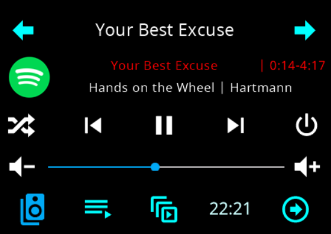
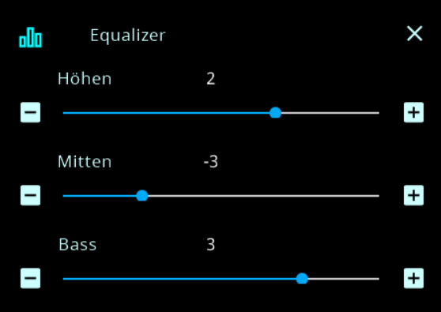
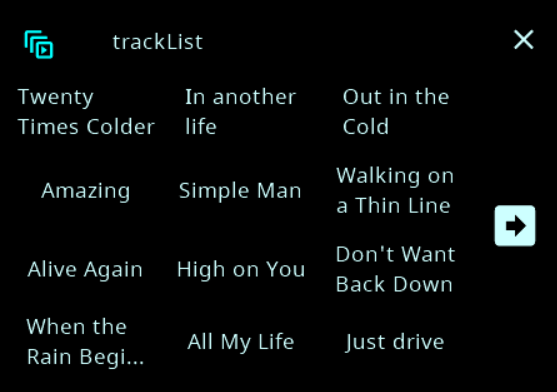
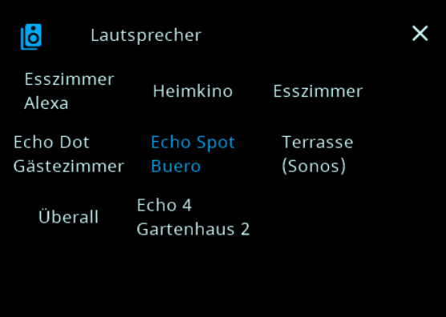
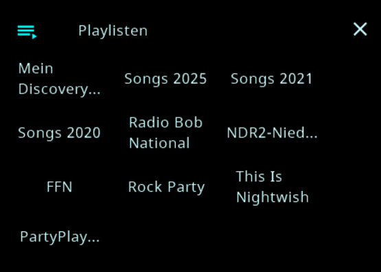

<!-- TODO: Translate from German to Italiano -->

# Mediaplayer (cardMedia)

**Stand:** 11.06.2025  
**Unterstützte Adapter:** `spotify-premium`, `alexa2`, `mpd`, `sonos`

Die Karte **`cardMedia`** zeigt einen Mediaplayer mit Titel/Artist, Play/Pause, Lautstärke u.v.m. an. Je nach Adapter werden unterschiedliche Funktionen automatisch erkannt (z. B. Playlisten, Shuffle, Seek).

---

## Minimal-Setup

```ts
const pageMediaTest1: PageType = {
  type: 'cardMedia',
  heading: 'main',
  uniqueName: 'main',
  media: {
    id: 'sonos.0.root.192_168_178_209', // Dein Player
  },
  items: [],
};
```

### `media.id` – Beispiele
- **alexa2**: `alexa2.0.Echo-Devices.<DEINE_ID>`
- **spotify**: `spotify-premium.0`
- **mpd**: `mpd.0`
- **sonos**: `sonos.0.root.192_168_178_209`

> **Hinweis:** Gibst du nur den Adapternamen ohne Instanznummer an (z. B. `spotify`), wird automatisch die **kleinste vorhandene Instanz** verwendet.

---

## Eigene PageItems
`items` verhält sich wie bei `cardGrid`/`cardEntities`. Du kannst eigene PageItems hinzufügen. **Adapter‑interne Templates** sind auf `cardMedia` nicht anwendbar.

---

## Wichtige `media`‑Optionen (Kurzüberblick)

| Option | Bedeutung | Hinweise/Beispiele |
|---|---|---|
| `id` | Quelle/Player (Ordner/Device/Channel, **kein State**) | Siehe Beispiele oben |
| `name` | Anzeigename | Leer lassen → Name wird automatisch ermittelt |
| `colorMediaIcon` | Farbe für das Media‑Icon | **Verwende Farbnamen** (z. B. `Blue`, `MSRed`)  |
| `colorMediaArtist` | Farbe für die Artist‑Zeile | s. Farbe |
| `colorMediaTitle` | Farbe für die Titel‑Zeile | s. Farbe |
| `speakerList` | Liste erlaubter/angezeigter Lautsprecher | **Sonos/Spotify:** Auswahl ohne Liste → keine Speaker. **Andere:** Whitelist (leer = alle) |
| `favoriteList` | **Whitelist** für Favoriten‑Playlists | Leer oder nicht gesetzt = zeige alle |
| `playList` | Liste verfügbarer Playlists | **Alexa/Spotify:** aus Adapter. **Sonos:** nutzergeneriert (Adapter kann sie nicht einlesen) |
| `minValue` | Minimale Lautstärke (Panel) | Mapping auf Geräte‑Skala |
| `maxValue` | Maximale Lautstärke (Panel) | Mapping auf Geräte‑Skala |
| `itemsColorOn` | On‑Farbe für einzelne Standard‑PageItems | pro Item überschreibbar (s. unten) |
| `itemsColorOff` | Off‑Farbe für einzelne Standard‑PageItems | s. unten |
| `deactivateDefaultItems` | Standard‑PageItems gezielt ausblenden | s. unten + Beispiel |

### Standard‑PageItems (für Farben/Deaktivieren)
- `trackList`, `speakerList`, `repeat`, `equalizer`, `playList`, `online`, `reminder`, `clock`, `favoriteList`, `crossfade`

> **Farben verwenden:** An dieser Stelle **bitte Farbnamen** wie `Blue`, `MSRed`, `HMIOn`, `HMIOff` etc. benutzen – **es ist auch möglich eigene zu verwenden** `{red:…, green:…, blue:…}`‑JSON.  
> (Nur in Beispielen unten werden Farbnamen gezeigt – es gibt keine separate Farbtabelle in dieser Doku.)

---

## Beispiele

### 1) Farben pro Item überschreiben
```ts
media: {
  id: 'spotify-premium.0',
  itemsColorOn: {
    playList: Blue,
    speakerList: MSRed,
  },
  itemsColorOff: {
    playList: Gray,
  },
}
```

### 2) Standard‑Items ausblenden
```ts
media: {
  id: 'alexa2.0.Echo-Devices.DEINE_ID',
  deactivateDefaultItems: {
    trackList: true,
    equalizer: true,
    crossfade: true,
  },
}
```

### 3) Whitelist für Favoriten / eigene Playlists
```ts
media: {
  id: 'sonos.0.root.192_168_178_209',
  favoriteList: ['Best of 90s', 'Morning Vibes'], // Whitelist – nur diese anzeigen
  playList: ['Living Room Mix', 'Party'],        // Sonos: nutzergeneriert
}
```

### 4) Lautstärke‑Range am Panel begrenzen
```ts
media: {
  id: 'mpd.0',
  minValue: 5,   // Panel lässt nicht unter 5
  maxValue: 80,  // und nicht über 80
}
```

---

## Hinweise & Verhalten
- Der Adapter sammelt je nach Quelle automatisch passende States (Titel, Artist, isPlaying, Shuffle, Volume …) und erzeugt **passende PageItems**. Nicht jeder Adapter kann alles (z. B. Playlists).
- **Seek/Play/Pause/Shuffle/Volume**: Wenn die Quelle es anbietet, werden die Controls eingeblendet.
- **Logo‑Feld**: Je nach Quelle kann das Logo z. B. Play/Pause toggeln oder ein Seek‑Popup öffnen.

---

## Bilder zur cardMedia

Hauptseite z.B.  Alexa oder Spotify  
   
  
Equalizer und Trakliste  
   
  
Speaker und Playlist  
   
  
Bilder können je nach Konfiguration abweichen oder nicht vorhanden sein  

```typescript
// Nur als Referenz – die Erklärung steht oben.
// Farben bitte als Symbolnamen (z. B. Blue, MSRed) nutzen.

type RGB = { r: number; g: number; b: number };

type MediaOptions = {
  id: string;
  name?: string;
  colorMediaIcon?: RGB;
  colorMediaArtist?: RGB;
  colorMediaTitle?: RGB;
  speakerList?: string[];
  /** Whitelist von Favoriten; leer/fehlend → zeige alle */
  favoriteList?: string[];
  /** Playlisten: Alexa/Spotify aus Adapter; Sonos nutzergeneriert */
  playList?: string[];
  /** Lautstärke-Grenzen (Panel-Seite) */
  minValue?: number;
  maxValue?: number;

  /** On-/Off-Farben pro Default-Item */
  itemsColorOn?: Partial<Record<
    'trackList' | 'speakerList' | 'repeat' | 'equalizer' | 'playList' | 'online' | 'reminder' | 'crossfade' | 'favoriteList',
    RGB
  >>;
  itemsColorOff?: Partial<Record<
    'trackList' | 'speakerList' | 'repeat' | 'equalizer' | 'playList' | 'online' | 'reminder' | 'crossfade' | 'favoriteList',
    RGB
  >>;

  /** Default-Items ausblenden */
  deactivateDefaultItems?: Partial<Record<
    'trackList' | 'speakerList' | 'repeat' | 'equalizer' | 'playList' | 'online' | 'reminder' | 'clock' | 'favoriteList' | 'crossfade',
    boolean
  >>;
};
```
      
