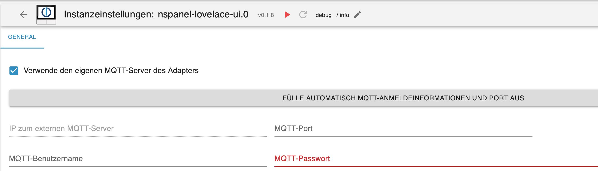
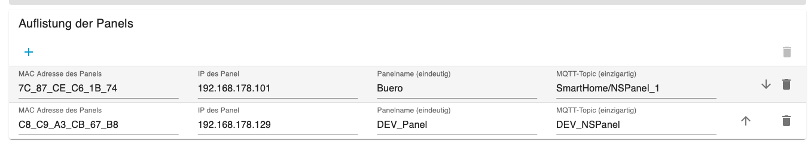
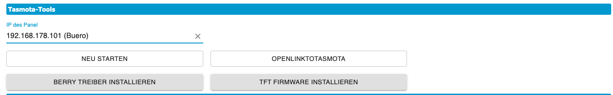
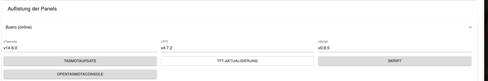
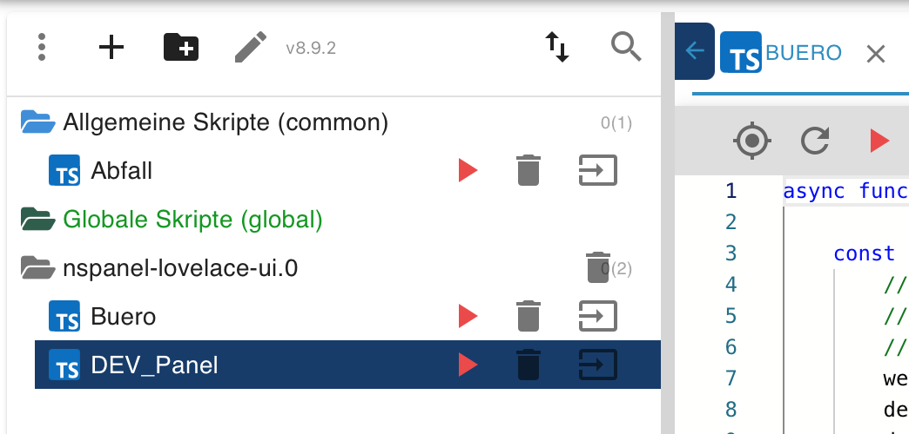

<!-- TODO: Translate from German to Português -->

## Grundeinstellung (MQTT)
Im Tab `General` muss der MQTT eingestellt und die Pin für die Serviceseiten vergeben werden.  

  - Bei der Nutzung des internen MQTT Server (**vom Adapter**), ist es möglich, über den Button die Daten automatisch ausfüllen zu lassen. Diese Funktion sucht auch einen freien Port, damit es nicht zu Problemen  mit anderen Adapter kommt. (z.B. Shelly, Sonoff). Es werden **alle** MQTT-Einstellungen in Tasmota überschrieben und an den **Adater-MQTT-Server** angepasst.  
  - Bei Nutzung eines externen MQTT-Servers (mosquitto oder MQTT-Adapter) sind die Felder unten entsprechend selbst auszufüllen.  
    - IP zum externen MQTT-Server -> Beim MQTT-Adapter ist die IP vom iobroker einzutragen.  
    - MQTT-Port -> es daruf zu achten, dass der Port nicht schon von einem anderen Adapter oder Dienst/Service genutzt wird.  
    - Benutzername und Passwort -> mit welchem sich Tasmota (Panel) beim Server anmelden muss.  

  
  - nach dem Speichern kann auf der Seite `Panel Einstellungen` gewechselt werden. 

## Panel Einstellungen  
  
    
  
- die IP-Adresse, nach Möglichkeit eine feste IP im Router einstellen  
- einen Namen für das Panel vergeben  
- den Mqtt-Topic unter dem das Panel lauscht  
- den Panel-Typ [EU, US-P, US-L]  
- Zeitzone auswählen  

zum Schluss auf den Button `NSPanel-Initialisierung` klicken.  
Es werden die MQTT-Daten und Tasmota-Einstellungen an das Panel gesendet und damit alle Einstellungen richtig gesetzt. Desweiteren wird der Berry-Treiber installiert, sowie die NSPanel Firmware installiert(ca. 10 Minuten).  
Nach der Initialisierung wird das Panel in die Liste automatisch eingetragen.  

  
_Informationen nicht ausführen_
Mit den Tasmota-Tools, diese sind haupsächlich zur Fehlerbehebung vorhanden, kann der Berry-Treiber und die TFT-Firmware installiert/neuinstalliert werden. Dazu wird die IP/Panel im Feld `IP des Panel` ausgewäht. Zusätlich besteht die Möglichkeit Tasmota neu zu starten und in die WebUI von Tasmota zu springen. (neues Fenster / Popup) 

_ab hier wieder weiter_
Im Anschuss die Einstellungen Speichern und den Admin einmal schliessen. Danach kann mit der [Maintain Seite](#maintain) weiter gemacht werden.

## Maintain  

  

In der Seite `Maintain` das Panel auswählen und über den Button `Script` die aktuelle Version des Konfig-Scriptes anlegen. Es wird im JavaScript-Adapter in einem Ordner mit dem Namen der Adapter-Instanz gespeichert. Der Dateiname gleicht dem Panelnamen. Die anderen Einstellungen werden im Kapitel [**Adapter Admin** / Maintain](Maintain) erläutert.  

- das Konfig-Script 

[Beispiel Konfigurationsskript](https://github.com/ticaki/ioBroker.nspanel-lovelace-ui/blob/main/script/example_sendTo_script_iobroker.ts)
  
Jetzt das Script einmal starten (es beendet sich selbst wieder) und die Instanz neu starten. Wenn alles richtig gemacht wurde, sollte jetzt die Serviceseite auf dem Panel erscheinen.  
Weitere Erläuterungen zu diesem Script erhaltet ihr hier. [**Konfiguratiosscript** / Einleitung](ScriptConfig)  

Bei Fragen fragen - Discord, Frum, hier, Telegram, Teams alles vorhanden :)

[Alias Tabelle](https://github.com/ticaki/ioBroker.nspanel-lovelace-ui/blob/main/ALIAS.md)  
