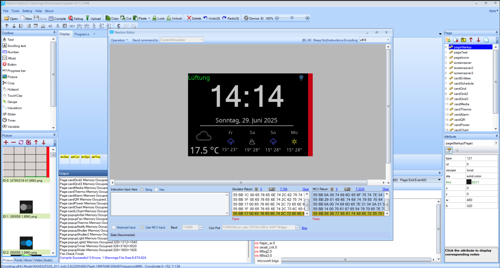
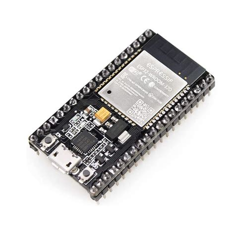
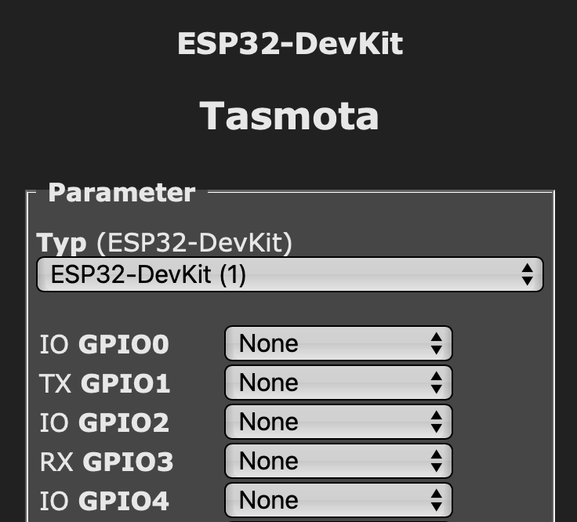
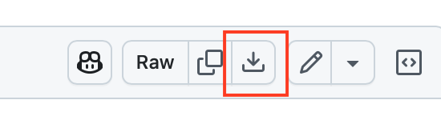
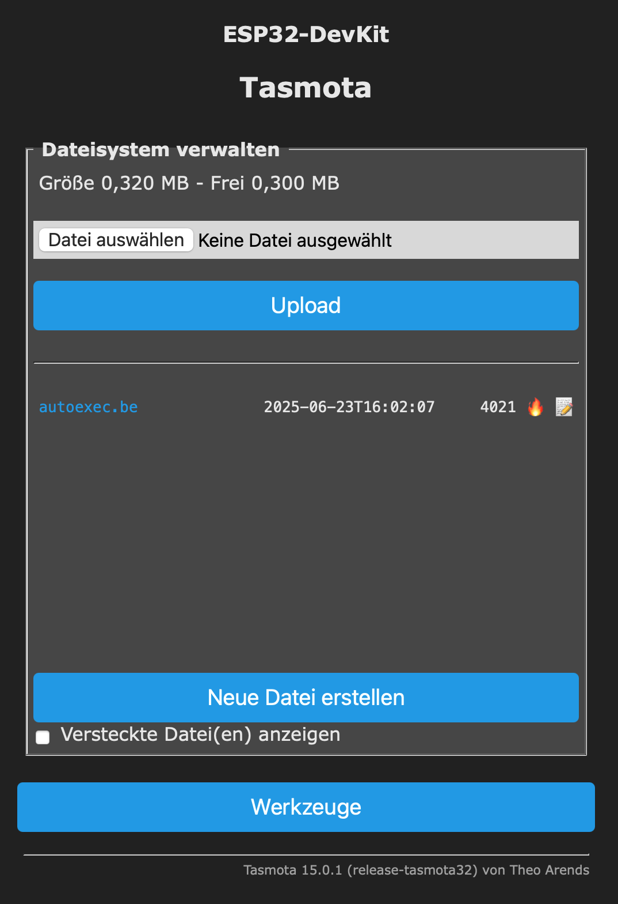
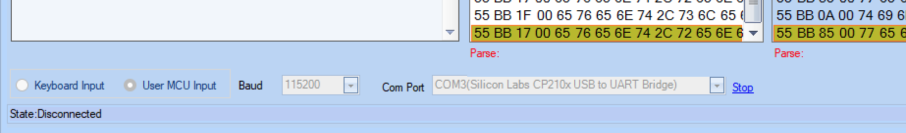

<!-- TODO: Translate from German to Русский -->

# Das ioBroker Skript auch ohne NSPanel ausprobieren

## Einleitung

Wenn man sein NSPanel schon fest verbaut hat und dann z.B. eine neue Seite konfigurieren muss, dann ist man ständig zwischen seinem Rechner und dem Panel am hin-und-her laufen um die Funktionalität zu testen. Die Bewegung als solches mag gut tun, ist aber hier der Effizienz in der Entwicklung der neuen Seite nicht zuträglich.
Auch nach einem Update des ioBroker Skripts kann man mit dieser Lösung einfach im Emulator testen, ob noch alles klappt, bevor man das Skript in seiner Live-Instanz aktualisiert.
Und Last but not least ist diese Möglichkeit auch für all diejenigen Interessant, die noch kein NSPanel haben, aber selbiges vor dem Kauf einmal testen möchten.

  

## Voraussetzungen

Ihr braucht:  
* einen PC (ich habe es mit Windows 11 bei mir aktuell vertestet)  
* einen ESP32 mit Tasmota32  
* den Nextion Editor  
* und eine ioBroker-Installation.  

  

> Der ESP32 bleibt mit einem Datenkabel mit dem USB-Port des PC's verbunden.

## Vorbereitungen

Nachdem Euer ESP32 angekommen ist, müsst Ihr diesen via USB an den PC anschließen. Ich musste mir für meinen ESP32 noch den passenden Treiber installieren (CP210x_Universal_Windows_Driver). Nachdem ich den Treiber installiert hatte, taucht im Gerätemanager unter Anschlüsse bei mir ein _Silicon Labs CP210x USB to UART Bridge_ an _COM3_ auf.  

Nun installieren wir Tasmota über den Webinstaller auf dem ESP: Dazu ruft Ihr die Seite https://tasmota.github.io/install/ im Browser auf. Lt. Dokumentation von Tasmota müsst Ihr hierfür den Browser Edge oder Chrome nehmen. Dort wählt Ihr rechts im Auswahlmenü _ESP32_ und links im Auswahlmenü _Tasmota DE_. Anschließend klickt Ihr auf _CONNECT_ und wählt den COM-Port von Eurer CP210x USB to UART Bridge aus.  

Nachdem die Verbindung hergestellt wurde, installiert ihr Tasmota auf dem EPS32. War die Installation erfolgreich, könnt Ihr im nächsten Schritt Eure WLAN-Daten eintragen.  
Nachdem die WLAN-Daten hinterlegt sind, gelangt Ihr mit einem weiteren Klick direkt auf die Tasmota Seite vom Gerät. War dies Erfolgreich, schließen wir die Tasmota Installation Seite und trennen kurz die USB Verbindung.  

Nachdem nun der ESP wieder erreichbar ist, prüft man in den Einstellungen unter _Gerät konfigurieren_, ob RX (GPIO3) und TX (GPIO1) auf none stehen.

   

Anschließend könnt Ihr Tasmota und MQTT über den Admin des Adapter einstellen. Da zu volgt ihr der Anleitung bis zu dem Punkt, wo ihr den Button für NSPanel Initzialisierung drückt. [Link zur Anleitung](Adapter-Installation.md#grundeinstellung)  

## Berry-Driver für Emulation  
**ACHTUNG:** Nicht den Berry Treiber hier aus dem Wiki nehmen, sondern hier aus dem nachfolgenden Link  

Zuerst ladet ihr euch diese Datei aus Gihub [tasmota/Emulator/autoexec.be](https://github.com/ticaki/ioBroker.nspanel-lovelace-ui/blob/main/tasmota/Emulator/autoexec.be) herrunter.

  

Wenn das Panel in der Liste angezeigt wird, muss der Berry Treiber von Hand installiert werden. 
Dazu wechselt ihr wieder auf euren ESP32 Chip und geht auf "Werkzeuge -> Dateisystem verwalten"  

  

Sollte jetzt wie im Bild zusehen ist, schon eine autoexec.be enthalten sein löscht diese mit dem Flammen Symbol.  
Mit dem Button "Datei auswählen" wählt ihr die geladene Datei aus und mit klick auf `Upload` wird sie auf den Chip geladen.  

Nachdem die autoexec.be erstellt wurde, den ESP32 einmal rebooten.

## Installation des Nextion Editor

Zunächst braucht man noch den Nextion Editor: 
> https://nextion.tech/nextion-editor/  

sowie die HMI-Datei hier aus dem Repository (liegt im Verzeichnis HMI). Nachdem der Editor installiert ist, diesen Starten und die Datei nspanel.hmi im Nextion Editor öffnen. Anschließend im Editor oben auf Debug klicken. Es öffnet sich ein neues Fenster. Dort unten links von _Keyboard Input_ auf _User MCU Input_ umstellen, den COM-Port des ESP auswählen und die Baud-Rate auf 115200 stellen. Mit Start verbindet man sich nun zum ESP.

    

Nun kann das DEV-Skript im ioBroker ausgeführt werden. Hat man alles richtig gemacht, erscheint nach kurzer Zeit die erste Seite im Nextion Editor.

Nun hab Ihr ein vollständig klickbares, emuliertes NSPanel, in welchem Ihr eure neuen Seiten ohne Zugriff auf Euer echtes Panel bequem entwerfen und vertesten könnt. Wenn man dann mit seinen Änderungen zufrieden ist, kann man die Änderungen vom Skript nun in das Produktionsskript eintragen!

## Hinweise

**Noch ein paar Hinweise**:  
* Die ESP32 Temperatur mit setOptions146 1 einschalten.  
  
* Im Gengensatz zum "echten" NSPanel hat der Emulator-ESP32 keinen eingebauten Temperatursensor und auch keine eingebauten Buttons/Relais. Es kann somit keine Daten hierfür in die Datenpunkte transportieren. Um Fehler zu vermeiden, sollte im Datenpunkt:
`0_userdate.0.NSPanel.Dev.Sensor.ANALOG.Temperature`
ein Temperaturwert für die Raumtemperatur (z.B. 21) eingetragen werden.

* Ebenfalls sind die Werte für die Status Icons im Screensaver nicht vorhanden. Da der Emulator in der Regel ein bereits  vorhandenes physisches NSPanel emuliert, können die MQTT-Pfade für die Relais-Icons auch auf das physische NSPanel verweisen.

**Viel Spaß mit dem Emulator!**